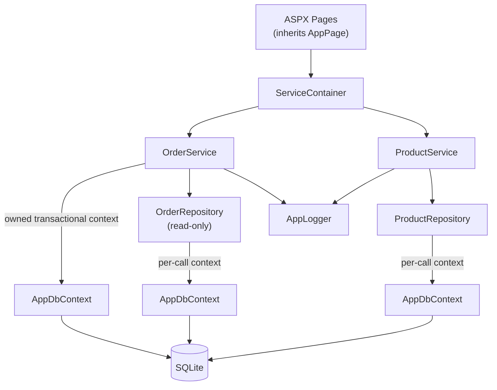
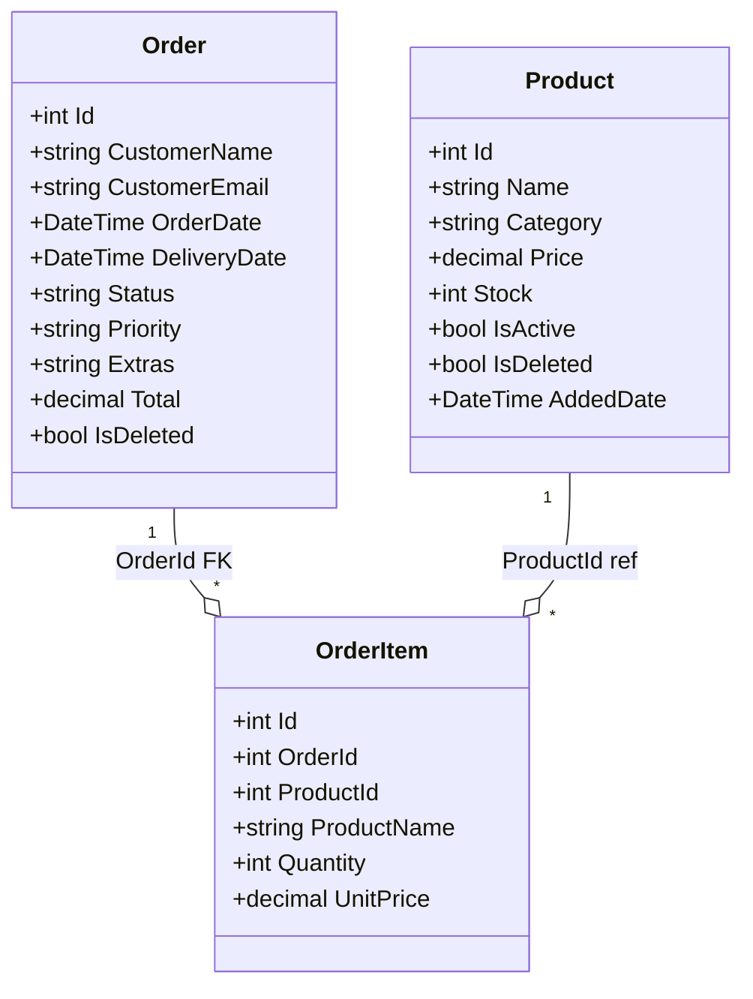

# CoreWebForms: Inventory Manager

ASP.NET Core inventory management app migrated from ASP.NET WebForms 4.8 using `CoreWebForms.Sdk`. Runs on .NET 9 with Kestrel self-hosting, EF Core 9, and SQLite. No authentication, no tests, local development only.

> **Migrated from** [`../LegacyWebForms/`](../LegacyWebForms/) — see [`docs/migration/`](docs/migration/) for the step-by-step migration guide.

## Quick Start

```bash
dotnet build CoreWebForms.csproj
```

Press **F5** in VS Code. The browser opens automatically when the server is ready. The SQLite database and seed data (12 products, 12 orders) are auto-created on first run at `App_Data/inventory.db`. Delete this file to re-seed.

URL: `http://localhost:8081`

## Tech Stack

| Layer | Technology |
|-------|-----------|
| Framework | ASP.NET Core on .NET 9, `CoreWebForms.Sdk 1.0.0`, Kestrel |
| WebForms bridge | `Microsoft.AspNetCore.SystemWebAdapters` via `CoreWebForms.Sdk` |
| ORM | EF Core 9.0.17 with SQLite |
| ASPX compilation | Runtime Roslyn compilation via `EnableRuntimeAspxCompilation=true` |
| Session | `IDistributedCache`-backed session with JSON serializer |
| Logging | `System.Diagnostics.Trace` + file listener → `App_Data/logs/app.log` |

## Architecture



`AppData` is a static composition root initialized in `Program.cs` after `builder.Build()`. Pages access services via `AppData.Services.Products.*` and `AppData.Services.Orders.*`. No DI framework — WebForms creates pages and controls via reflection, making constructor injection impossible.

## Project Layout

```
Core/           AppConstants, AppPage (base class), ILogger interface, AppLogger
Services/       ProductService, OrderService (business logic layer)
Data/           IProductRepository, ProductRepository, IOrderRepository, OrderRepository,
                AppDbContext, DbSeeder (interfaces beside their implementations)
Models/         Product, Order, OrderItem, EventModels
Pages/          Default (Dashboard), Products, Orders (each with multiple child controls)
Helpers/        UiHelper (status badge HTML), GridViewHelper (sort arrow rendering)
Scripts/        site.js (global confirm dialog), combo.js (product autocomplete box)
Program.cs      ASP.NET Core host setup, middleware pipeline, route registration
```

## Pages

### Dashboard (`Pages/Default/`)

Single-fetch pattern: `Products.GetAll()` called once, result passed to StatCards, CategoryExpand, and OutOfStock. Two additional DB calls fetch order count and pending order count. Total: 4 DB calls per page load.

### Products (`Pages/Products/`)

GridView with in-memory sorting and filtering. Supports inline editing, read-only detail panel, and add-product panel. `ProductSummary` always reflects the live catalog regardless of active/inactive filter.

### Orders (`Pages/Orders/`)

Coordinator pattern: `Orders.aspx.cs` owns three child controls wired through events.

| Control | Role |
|---------|------|
| **OrderWizard** | 3-step wizard: select products via autocomplete, review, confirm. Cart stored in session. |
| **OrderHistory** | Paginated list via `GetPaged(skip, take)`. Shows all orders including soft-deleted (visually dimmed). |
| **OrdersManage** | Full GridView with inline edit, status filter, sort, soft-delete. Confirm dialog + server re-check guard. |

## Hosting

`Program.cs` replaces IIS hosting with Kestrel:

- DB init and logging setup moved from `Global.asax.Application_Start` → after `builder.Build()`
- Routes registered in `ApplicationStarted` callback (requires host to be running)
- Browser opened via `Process.Start` inside `ApplicationStarted` — fires only after routes are registered
- Middleware order: `UseRouting` → `UseSession` → `UseSystemWebAdapters` → `MapHttpHandlers` → `MapScriptManager`

## Data Model



Notable storage details:

- `Product.IsActive` and `Product.IsDeleted` use `HasConversion<bool, int>()` (EF Core 9 ValueConverter syntax) — SQLite has no native boolean type.
- `Order.Extras` is `List<string>` persisted as a pipe-delimited string.
- No concurrency tokens — SQLite EF Core provider silently ignores them.

## Key Migration Changes

| Area | Legacy | CoreWebForms |
|------|--------|-------------|
| Hosting | IIS Express / IIS | Kestrel (`Program.cs`) |
| Session | In-process | Distributed memory cache + JSON serializer |
| ASPX compilation | Pre-compiled by MSBuild | Runtime Roslyn via `EnableRuntimeAspxCompilation` |
| Routing | `web.config` defaultDocument | `RouteTable.Routes.MapPageRoute` in `ApplicationStarted` |
| Static files | IIS native | `UseStaticFiles` per directory |
| `Bind()` in ASPX | Supported | Not supported — replaced with `Eval()` + `FindControl()` |
| `UpdatePanel` | Supported | Not supported — removed, full postback |
| `CustomValidator` | Supported | Not supported — replaced with Label + manual validation |

## Detailed Documentation

| Document | Covers |
|----------|--------|
| [../docs/migration/00-index.md](../docs/migration/00-index.md) | Migration overview and phase index |
| [../docs/migration/01-project-setup.md](../docs/migration/01-project-setup.md) | csproj → CoreWebForms.Sdk, namespace rename |
| [../docs/migration/02-hosting.md](../docs/migration/02-hosting.md) | Program.cs, Global.asax, VS Code launch config |
| [../docs/migration/03-data-layer.md](../docs/migration/03-data-layer.md) | EF Core 9 upgrade, ValueConverter changes |
| [../docs/migration/04-session.md](../docs/migration/04-session.md) | Distributed session setup, JSON serializer |
| [../docs/migration/05-aspx-pages.md](../docs/migration/05-aspx-pages.md) | Bind→Eval, UpdatePanel removal, CustomValidator replacement |
| [../docs/migration/06-static-files-routing.md](../docs/migration/06-static-files-routing.md) | Static files, URL routing, middleware pipeline |
| [../docs/migration/07-net10-migration-blocked.md](../docs/migration/07-net10-migration-blocked.md) | Why .NET 10 migration is not yet possible |
| [../docs/implementation/](../docs/implementation/) | Full implementation docs |
