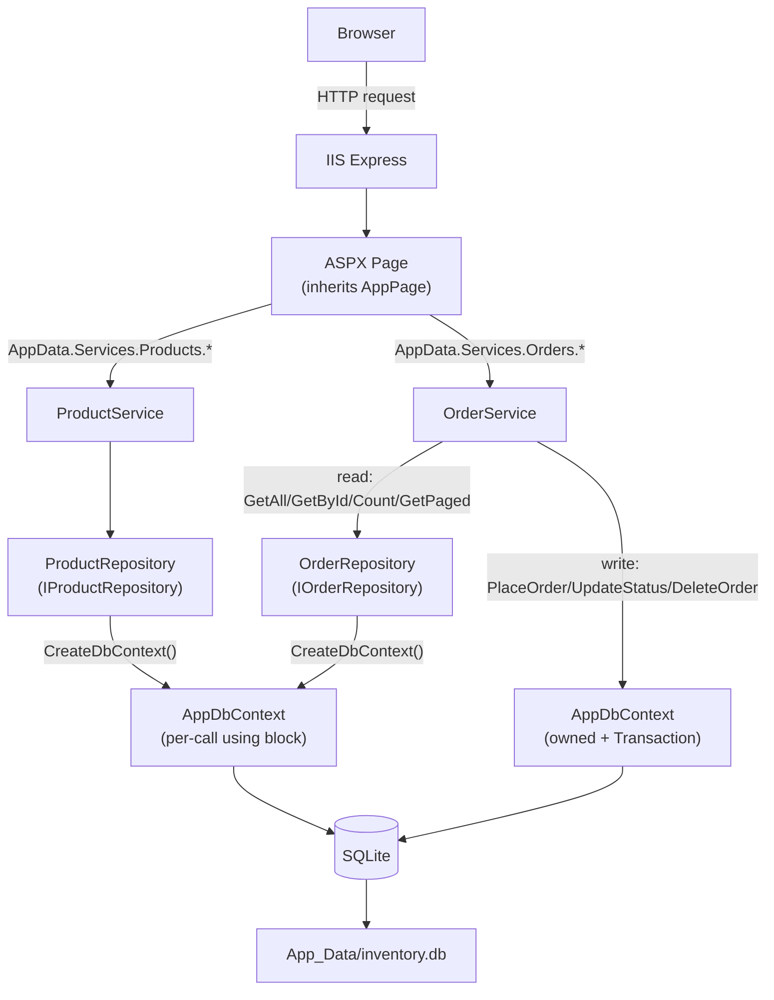
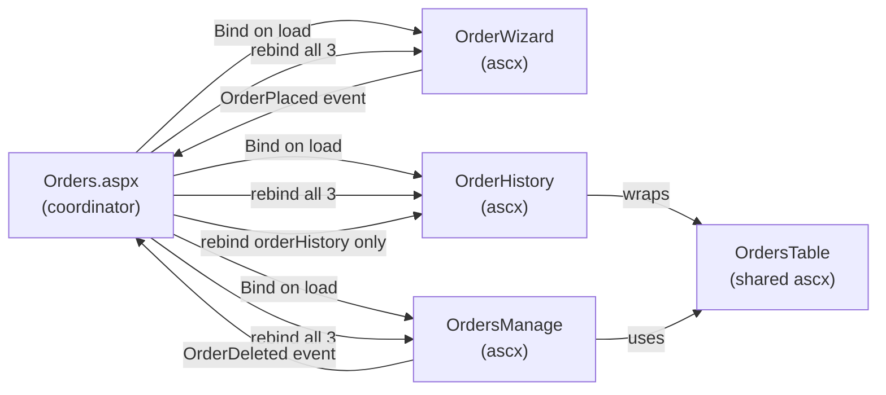
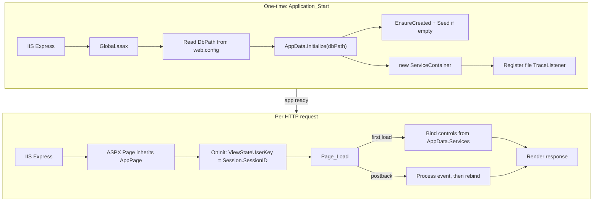

# Implementation, Index

ASP.NET WebForms 4.8 · EF Core 3.1.32 · SQLite · IIS Express  
SDK-style `.csproj`, `net48`, C# latest, nullable enabled.

## Sub-documents

| Doc | Coverage |
|-----|----------|
| [Core, startup & services](core.md) | AppConstants, AppPage, ILogger, AppLogger, Global.asax, AppData, ServiceContainer, ProductService, OrderService |
| [Data layer](data.md) | IProductRepository, ProductRepository, IOrderRepository, OrderRepository, AppDbContext, DbSeeder, Models, SQLite schema |
| [Pages & controls](pages.md) | Site.Master, Dashboard, Products, Orders, OrderWizard, OrderHistory, OrdersManage, shared controls |
| [Frontend, JS, helpers & shared UI](frontend.md) | combo.js, site.js, UiHelper, GridViewHelper, OrdersTable, UpdatePanel regions, badge CSS, static assets |
| [Configuration, security & deployment](config.md) | web.config, LegacyWebForms.csproj, ErrorPage.aspx, security model, deployment checklist, critical constraints |

---

## Project Structure

```
LegacyWebForms/
├── Layout/
│   └── Site.Master              # Master page: nav, confirm-dialog overlay
├── Pages/
│   ├── Default/                 # Dashboard
│   │   ├── Default.aspx + .cs
│   │   ├── StatCards/
│   │   ├── CategoryExpand/
│   │   └── OutOfStock/
│   ├── Products/
│   │   ├── Products.aspx + .cs
│   │   ├── ProductSummary/
│   │   ├── AddProductPanel/
│   │   └── ProductDetail/
│   ├── Orders/
│   │   ├── Orders.aspx + .cs    # Coordinator: wires 3 child controls
│   │   ├── OrderWizard/         # 3-step wizard + combo.js
│   │   ├── OrderHistory/        # Paginated history
│   │   └── OrdersManage/        # Full CRUD grid
│   ├── Shared/
│   │   ├── PageHeader/
│   │   └── OrdersTable/         # Shared order repeater
│   └── Errors/
│       └── ErrorPage.aspx
├── Core/                        # Constants + base classes + ILogger/AppLogger
├── Services/                    # Business-logic layer
├── Data/                        # Interfaces + EF Core context + repos + seeder
├── Models/
├── Helpers/
├── Scripts/
│   └── site.js
├── .vscode/                     # VS Code settings (exclude bin/obj/App_Data)
├── favicon.ico
└── App_Data/                    # SQLite DB + logs/ (auto-created at runtime)
```

> Directory purposes: [Core layer](core.md#core-layer), [Data layer](data.md), [Services](core.md#service-layer#service-layer), [Pages](pages.md)), [Helpers](frontend.md#helpers#helpers), [Configuration](config.md).

---

## Architecture

### Layer call flow



Pages call `AppData.Services` (the static `ServiceContainer`). ProductService delegates all operations to `ProductRepository`, which opens a short-lived context per call. OrderService reads via `OrderRepository` (same per-call pattern) but writes by opening its own context with a transaction: bypassing the read-only repository entirely. All roads end at the single SQLite file.

> Details: [ServiceContainer wiring](core.md#servicecontainer#servicecontainer), [ProductService](core.md#productservice-servicesproductservicecs#productservice-servicesproductservicecs), [OrderService](core.md#orderservice-servicesorderservicecs#orderservice-servicesorderservicecs), [Context lifetime](data.md#context-lifetime#context-lifetime), [SQLite schema](data.md#sqlite-schema#sqlite-schema).

### Component interaction: Orders page



`Orders.aspx.cs` is the coordinator: it owns three child controls and wires their events. On page load, each control's `Bind()` fetches its own data independently. Child controls never reference each other; they communicate only through events fired back to the coordinator. After an order is placed, all three are rebound (wizard needs fresh stock, history and manage need the new order). After a deletion, only history is rebound: manage already rebinds itself internally, and the wizard is intentionally left stale (self-corrects on next full load).

> Details: [Orders coordinator](pages.md#ordersaspx-coordinator#ordersaspx-coordinator), [OrderWizard](pages.md#orderwizard-pagesordersorderwizard#orderwizard-pagesordersorderwizard), [OrderHistory](pages.md#orderhistory-pagesordersorderhistory#orderhistory-pagesordersorderhistory), [OrdersManage](pages.md#ordersmanage-pagesordersordersmanage#ordersmanage-pagesordersordersmanage), [OrdersTable](pages.md#orderstable-pagessharedorderstableascx#orderstable-pagessharedorderstableascx).

### Startup → request flow



One-time startup: read `DbPath` from `web.config`, resolve to physical path, create/seed the SQLite database, wire up `ServiceContainer`, and register a file trace listener. Per-request: set `ViewStateUserKey` for CSRF, then on first load (`!IsPostBack`) fetch data from services and render. Postbacks skip the fetch and process the triggering event instead.

> Details: [Application_Start](core.md#globalasaxcs#globalasaxcs), [AppData.Initialize](core.md#appdata-dataappdatacs#appdata-dataappdatacs), [DbSeeder](data.md#dbseeder-datadbseedercs#dbseeder-datadbseedercs), [AppPage](core.md#apppage-coreapppagecs#apppage-coreapppagecs), [Page lifecycle](pages.md#webforms-page-lifecycle-relevant-events#webforms-page-lifecycle-relevant-events).

---

## Quick Reference

| Concept | Location | Key detail | See also |
|---------|----------|------------|----------|
| DI wiring | `Data/AppData.cs` → `ServiceContainer` | Manual composition root: constructs repos, services, and logger at startup in `Initialize()`. All pages access via `AppData.Services.*`. No framework needed since WebForms can't do constructor injection on pages/controls. | [ServiceContainer](core.md#servicecontainer#servicecontainer) |
| DB access entry point | `AppData.CreateDbContext()` | Returns a fresh `AppDbContext` per call. Repos use `using var db = CreateDbContext()` for short-lived reads. `OrderService` mutations hold the context open across multiple operations within a transaction. | [Context lifetime](data.md#context-lifetime#context-lifetime) |
| CSRF protection | `Core/AppPage.cs` | `ViewStateUserKey = Session.SessionID`: folds the session ID into the ViewState HMAC. A postback from a different session (e.g., attacker's crafted form) fails MAC validation and is rejected. | [AppPage](core.md#apppage-coreapppagecs#apppage-coreapppagecs) |
| Session cart | `const CartSessionKey = "CartItems"` in `OrderWizard` | `List<OrderItem>` stored in `Session`. `[Serializable]` attribute on `OrderItem` future-proofs for StateServer/SQLServer session modes. Cart persists across page loads; only clears on successful order or `btnNewOrder`. | [OrderWizard Step 1](pages.md#step-1-order-info#step-1-order-info) |
| Extras delimiter | `AppDbContext.OnModelCreating` | Pipe `\|` (not comma): comma in extra values like "Express delivery, priority" would silently split into two entries on roundtrip. Pipes don't appear in seeded values. | [OnModelCreating](data.md#onmodelcreating-configuration#onmodelcreating-configuration) |
| Bool → SQLite | `HasConversion<int>()` | SQLite has no native boolean. EF Core maps `true`/`false` to `1`/`0`. Applied to `Product.IsActive`, `Product.IsDeleted`, `Order.IsDeleted`. | [OnModelCreating](data.md#onmodelcreating-configuration#onmodelcreating-configuration) |
| Status regex | `Order.cs` DataAnnotation | `\A(Pending\|Processing\|Shipped\|Delivered)\z`: `\A`/`\z` anchors match string boundaries (not line boundaries like `^`/`$`), preventing multi-line bypass. | [Order model](data.md#order-modelsordercs#order-modelsordercs) |
| Priority regex | `Order.cs` DataAnnotation | `\A(Low\|Normal\|High)\z`: same anchor convention. `[Required]` attribute also present so null is caught before regex evaluation. | [Order model](data.md#order-modelsordercs#order-modelsordercs) |
| Native DLL path | MSBuild `CopyNativeSQLite` | Copies `e_sqlite3.dll` to `bin\` root at build time. SQLite EF Core provider needs this native DLL at runtime: it's not managed code. | [.csproj](config.md)) |
| Seed trigger | `AppData.EnsureDatabase` | `!db.Products.Any()` → `DbSeeder.Seed()`. Seeds 12 products and 12 orders with post-seed stock adjustment so DB is internally consistent on first load. | [DbSeeder](data.md#dbseeder-datadbseedercs#dbseeder-datadbseedercs) |
| Log output | `App_Data/logs/app.log` | `TextWriterTraceListener` registered in `Application_Start` with `TraceOptions.DateTime`. Guard prevents duplicate listener on app-domain recycle. `AutoFlush=true` ensures logs survive crashes. | [AppLogger](core.md#ilogger-coreiloggercs--applogger-coreapploggercs#ilogger-coreiloggercs--applogger-coreapploggercs) |
| Delivered order delete | Two-layer guard | UI: delete link disabled + grayed out in `RowDataBound`. Server: `btnConfirmDelete_Click` re-checks `Status == Delivered` before calling `DeleteOrder`. Prevents both accidental and crafted-form deletion. | [Deletion flow](pages.md#deletion-flow#deletion-flow) |
| OrderRepository | Read-only | No Add/Update/Delete methods. Order mutations (PlaceOrder, UpdateStatus, DeleteOrder) touch multiple entities (Order + Product stock) and require transactions: they live in `OrderService` which opens its own context. | [OrderRepository](data.md#orderrepository-dataorderrepositorycs#orderrepository-dataorderrepositorycs) |

