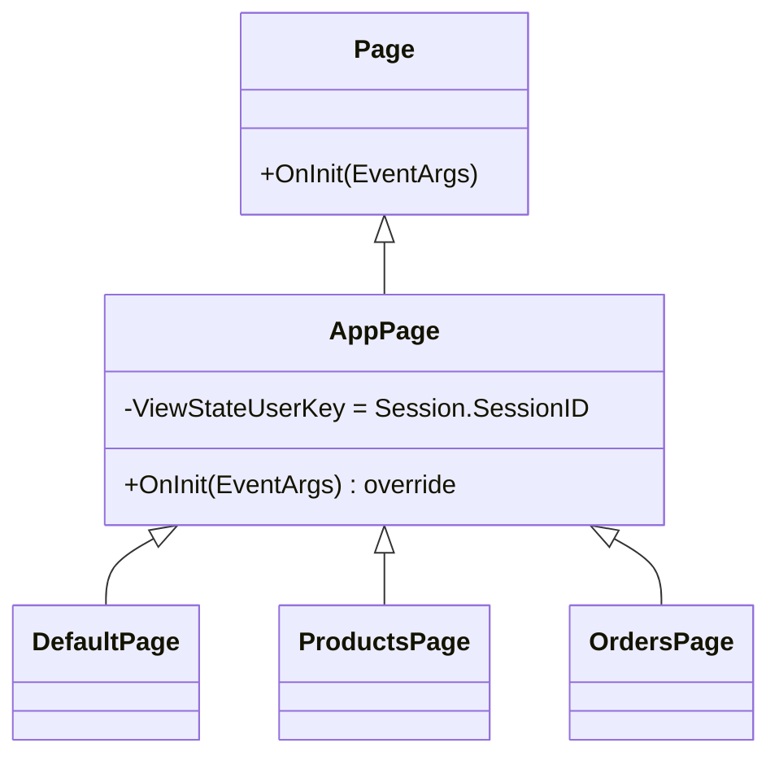
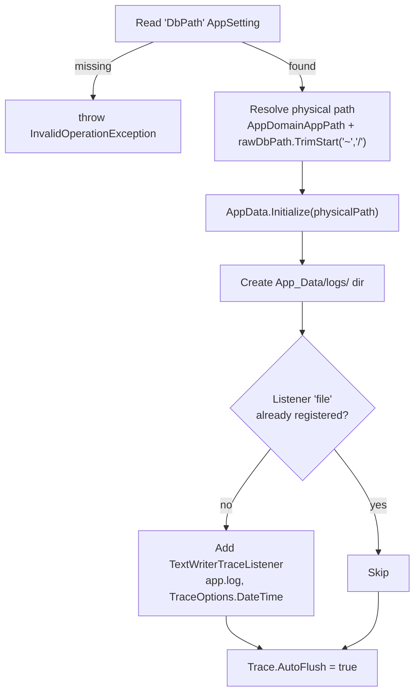
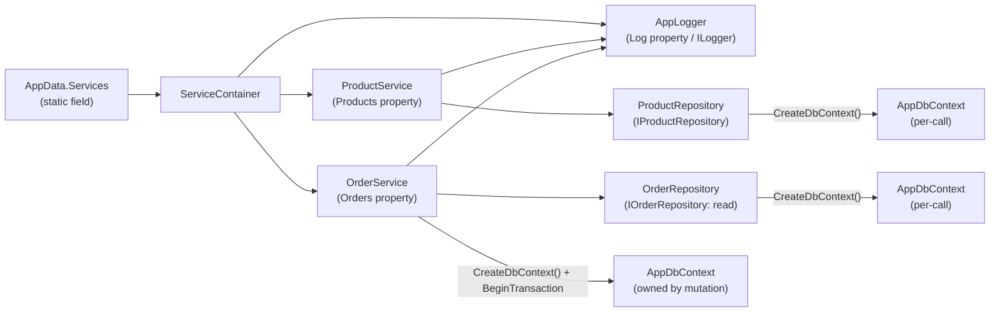
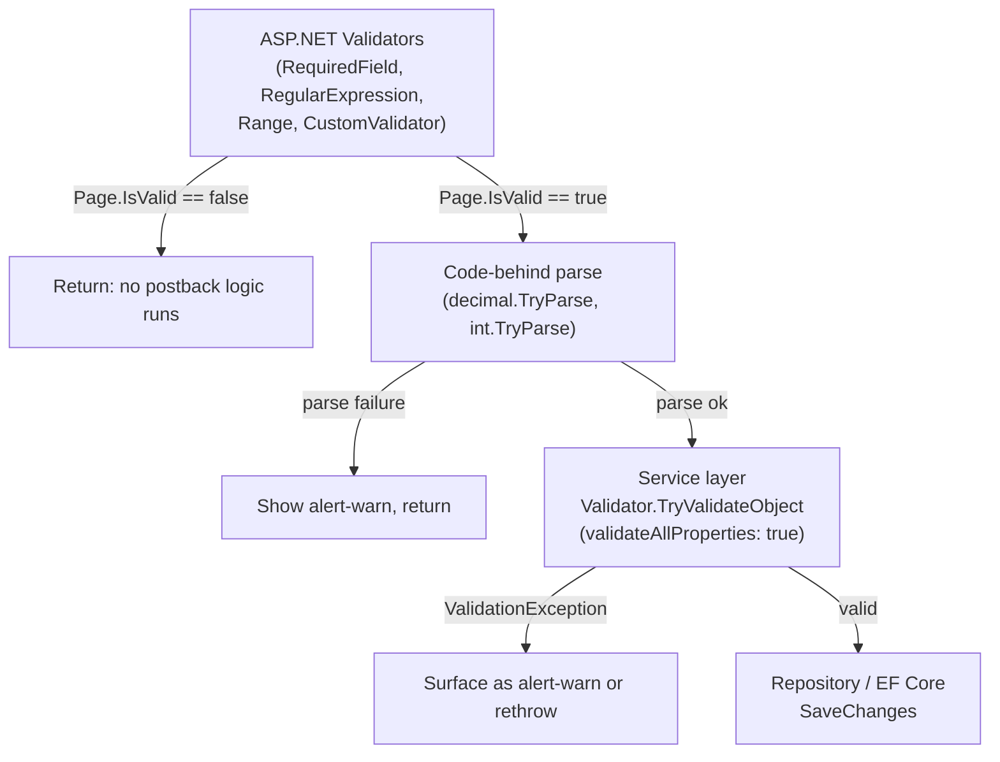
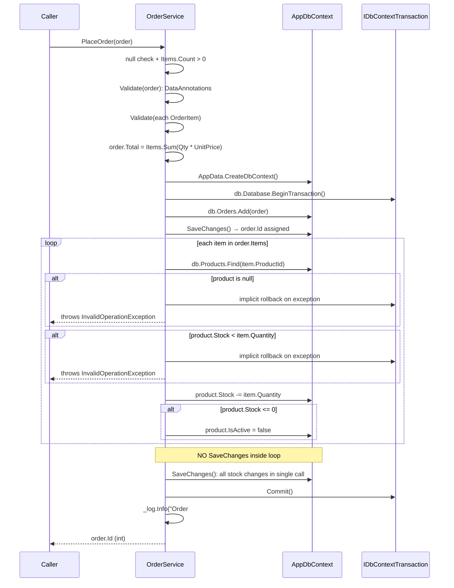
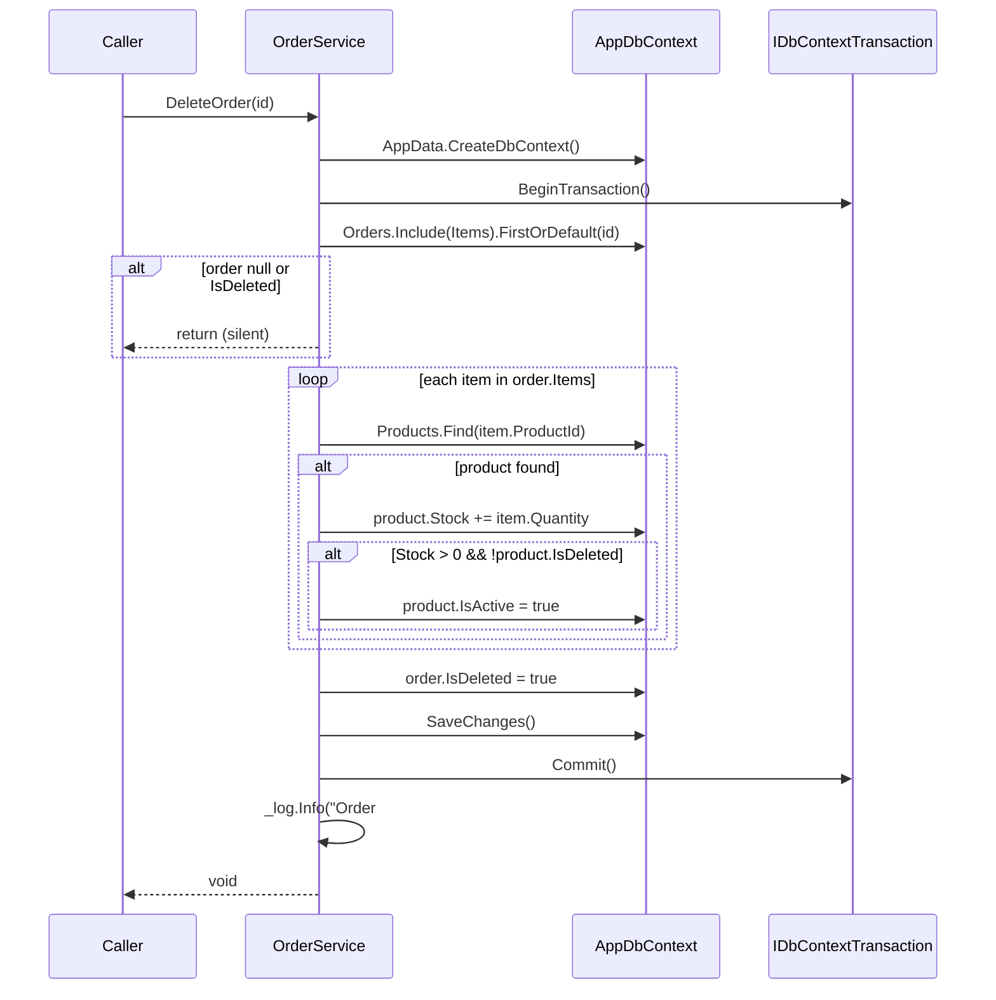
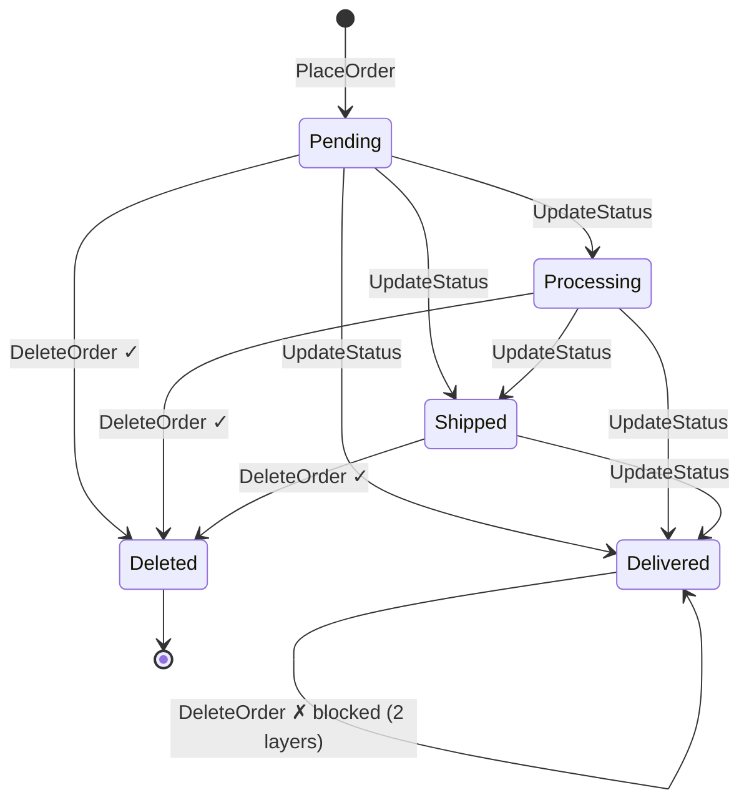

# Core, Startup & Services

← [Index](index.md)

Covers: `Core/` constants + base classes + `ILogger`/`AppLogger`, `Global.asax.cs`, `AppData.cs`, `ServiceContainer`, `Services/ProductService.cs`, `Services/OrderService.cs`.

---

## Core Layer

### AppConstants (`Core/AppConstants.cs`)

Single source of truth for all string constants used across services, UI, validators, and seeder.

```csharp
static class AppConstants
{
    public static readonly IReadOnlyList<string> Categories =
        new[] { "Electronics", "Clothing", "Food", "Books", "Sports" };

    public static class OrderStatus
    {
        public const string Pending    = "Pending";
        public const string Processing = "Processing";
        public const string Shipped    = "Shipped";
        public const string Delivered  = "Delivered";
    }

    public static class OrderPriority
    {
        public const string Low    = "Low";
        public const string Normal = "Normal";
        public const string High   = "High";
    }

    public static class UiLabels
    {
        public const string Deleted = "Deleted";
    }
}
```

Used in: `UiHelper.GetStatusBadge`, `OrdersManage.RowDataBound`, `OrderWizard.btnConfirm_Click`, `AddProductPanel`, `DbSeeder`, and all DataAnnotation regex validators.

### ILogger (`Core/ILogger.cs`) + AppLogger (`Core/AppLogger.cs`)

```
Info(string message)
Warning(string message)
Error(string message, Exception? ex = null)
```

### AppLogger (`Core/AppLogger.cs`)

Routes to `System.Diagnostics.Trace`: all registered `TraceListener` instances receive output.

| Method | Trace call | Exception format |
|--------|-----------|-----------------|
| `Info` | `Trace.TraceInformation(message)` | none |
| `Warning` | `Trace.TraceWarning(message)` | none |
| `Error` | `Trace.TraceError(message)` | `"{message} \| {ex}"` when exception present: `ex.ToString()` includes type name, message, and full stack trace |

File listener registered in `Global.asax.cs`. No file-path knowledge in `AppLogger` itself.

### AppPage (`Core/AppPage.cs`)

Base class for all three main pages (`DefaultPage`, `ProductsPage`, `OrdersPage`).



`OnInit` sets `ViewStateUserKey = Session.SessionID` before base `OnInit`. This folds the session ID into the ViewState HMAC: postbacks from a different session fail MAC validation, blocking CSRF.

---

## Startup and Initialization

### Global.asax.cs

#### Application_Start



#### Application_Error

```csharp
var ex     = Server.GetLastError();
if (ex == null) return;                   // early guard: no error to log
var baseEx = ex.GetBaseException();           // unwrap AggregateException / HttpUnhandledException
AppData.Services?.Log.Error(
    string.Format("Unhandled error on {0}", Request?.RawUrl), baseEx);
```

Error logging fires before `customErrors` redirect. `Server.GetLastError()` is null-checked first: no-op if no error occurred. Full stack trace (via `ex.ToString()`) goes to `app.log`; only generic message reaches client. `Request?.RawUrl` is null-safe for contexts where Request is unavailable.

### AppData (`Data/AppData.cs`)

Static class. Initialized once at startup, available for the app lifetime.

| Member | Type | Detail |
|--------|------|--------|
| `DbPath` | `string` | Resolved physical path |
| `Services` | `ServiceContainer` | Single instance: all pages read from here |
| `CreateDbContext()` | `AppDbContext` | New context per call: used by `OrderService` mutations and indirectly by repos. Throws `InvalidOperationException` if called before `Initialize()` completes (guard: `if (string.IsNullOrEmpty(DbPath))`) |

`Initialize(dbPath)`:
1. `dbPath ?? throw new ArgumentNullException(nameof(dbPath))`: null input → `ArgumentNullException`.
2. Validates against compiled Regex `\A[^\x00-\x1f;]+\z`: rejects semicolons (connection-string injection) and control chars (newline injection for `Attach` directives). Empty/invalid → `ArgumentException`.
3. `Directory.CreateDirectory(Path.GetDirectoryName(dbPath))`.
4. `EnsureDatabase(dbPath)`: opens `AppDbContext`, calls `EnsureCreated()`, seeds if empty.
5. `Services = new ServiceContainer(new ProductRepository(), new OrderRepository(), new AppLogger())`.

### ServiceContainer



No DI framework. Constructor wires all dependencies explicitly:

```csharp
Services = new ServiceContainer(
    new ProductRepository(),
    new OrderRepository(),
    new AppLogger()
);
```

---

## Service Layer

### Validation Cascade

Three independent validation layers, outermost catches first:



The service layer fires `Validator.TryValidateObject` even when called from non-UI paths (e.g. tests, future CLI tools): validation is not skipped by bypassing the UI.

### ProductService (`Services/ProductService.cs`)

```csharp
public ProductService(IProductRepository repo, ILogger log)
```

`Validate(model)`: private static, called by `Add` and `Update`:
```csharp
var results = new List<ValidationResult>();
if (!Validator.TryValidateObject(model, new ValidationContext(model), results, true))
    throw new ValidationException(string.Join("; ", results.Select(r => r.ErrorMessage)));
```

| Method | Steps |
|--------|-------|
| `GetAll(includeDeleted)` | Pass-through to `_repo.GetAll` |
| `GetById(id)` | Pass-through to `_repo.GetById` |
| `Add(product)` | ArgNull check → `Validate(product)` → `_log.Info("Adding product: {Name}")` → `_repo.Add` → return Id |
| `Update(product)` | ArgNull check → `Validate(product)` → if `Stock == 0`: `IsActive = false` → `_log.Info("Updating product #{Id}")` → `_repo.Update` |
| `Delete(id)` | `_log.Info("Soft-deleting product #{id}")` → `_repo.Delete` |

`Update` enforces the invariant: a product with zero stock cannot be active, regardless of what the caller sets `IsActive` to.

### OrderService (`Services/OrderService.cs`)

```csharp
public OrderService(IOrderRepository repo, ILogger log)
```

Read methods delegate directly. Mutation methods open their own `AppDbContext` with a transaction: they do not use `IOrderRepository` for writes.

#### PlaceOrder



#### UpdateStatus

```
db.Orders.Find(orderId)
  → null or IsDeleted → _log.Warning(...); return   // silent skip, not an exception
  → set Status + Priority
  → Validate(order): DataAnnotations (regex on Status/Priority)
  → SaveChanges()
  → _log.Info("Order #{Id} status changed to {Status}")
```

#### DeleteOrder



#### Order Status Lifecycle



### Log Sites

| Level | Method | Message pattern |
|-------|--------|----------------|
| Info | `PlaceOrder` | `Order #{Id} placed for {Name} ({Count} items, ${Total:F2})` |
| Info | `UpdateStatus` | `Order #{Id} status changed to {Status}` |
| Info | `DeleteOrder` | `Order #{Id} deleted, stock restored for {N} items` |
| Warning | `UpdateStatus` | `Rejected status update on deleted/missing order #{Id}` |
| Info | `ProductService.Add` | `Adding product: {Name}` |
| Info | `ProductService.Update` | `Updating product #{Id}` |
| Info | `ProductService.Delete` | `Soft-deleting product #{Id}` |
| Error | `Global.asax Application_Error` | `Unhandled error on {RawUrl}` + exception |
| Error | `OrdersManage.RowUpdating` | `Failed to update order #{Id}` + exception |
| Error | `OrdersManage.btnConfirmDelete` | `Failed to delete order #{Id}` + exception |
| Error | `Products.RowUpdating` | `Failed to update product #{Id}` + exception |
| Error | `AddProductPanel.btnSaveNew` | `Failed to add product` + exception |
| Error | `OrderWizard.btnConfirm` | `Failed to place order` + exception |

