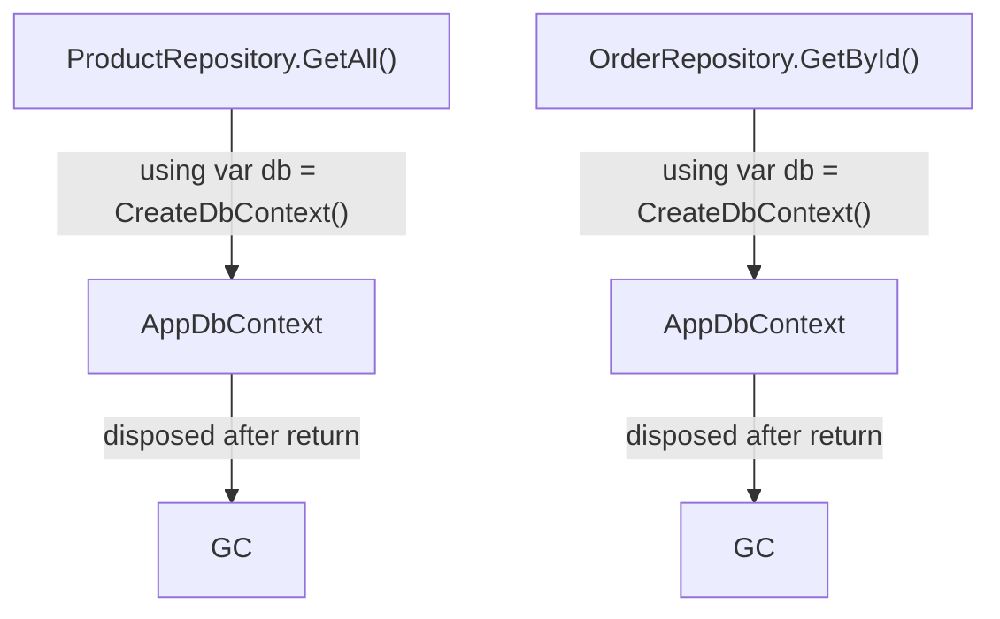
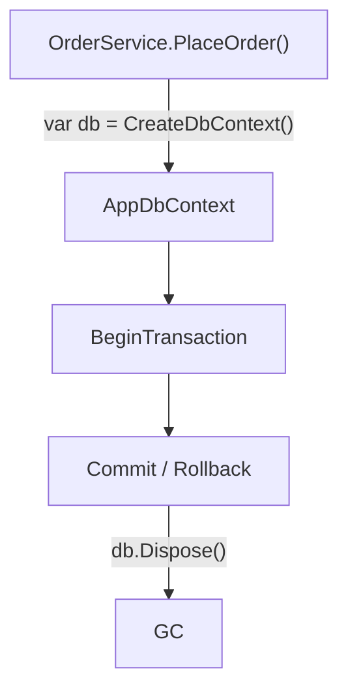
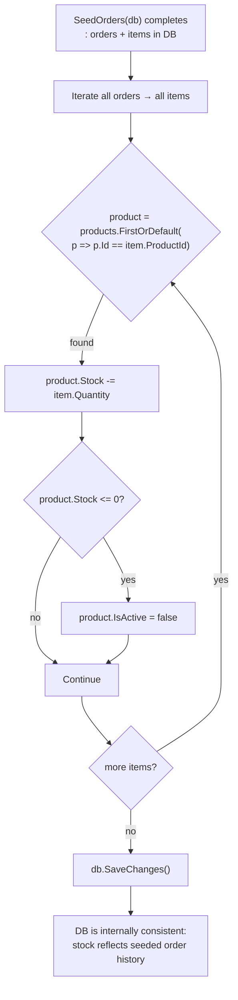
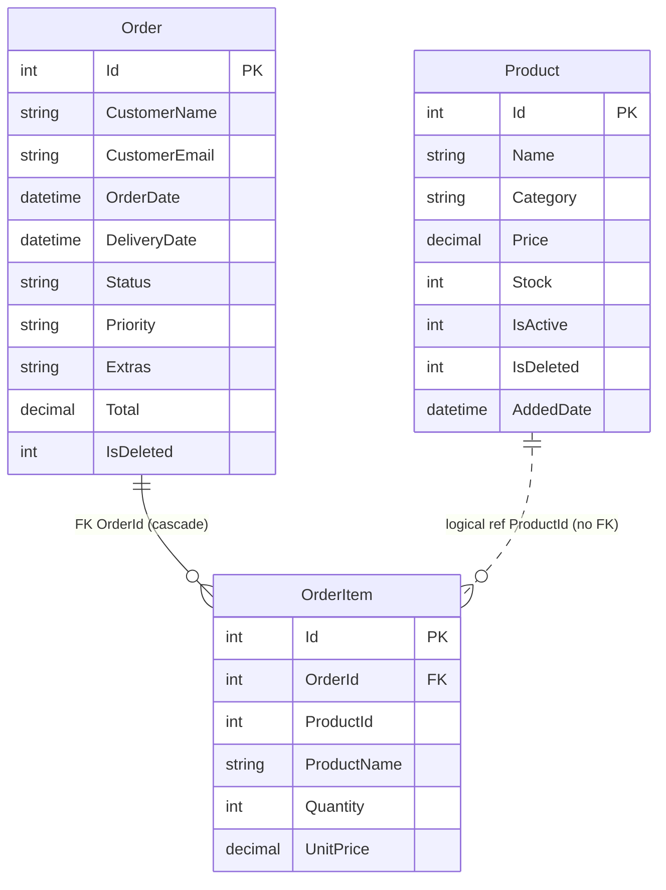

# Data Layer

← [Index](index.md)

Covers: `Data/AppDbContext.cs`, `Data/IProductRepository.cs`, `Data/ProductRepository.cs`, `Data/IOrderRepository.cs`, `Data/OrderRepository.cs`, `Data/DbSeeder.cs`, `Models/`.

---

## AppDbContext (`Data/AppDbContext.cs`)

```csharp
private readonly string _connectionString;

public AppDbContext(string dbPath)
{
    _connectionString = $"Data Source={dbPath}";
}

protected override void OnConfiguring(DbContextOptionsBuilder options)
    => options.UseSqlite(_connectionString);
```

### Context Lifetime

Two patterns exist: short-lived per-call (repos) and owned transactional (service mutations). Never mix them.

**Per-call pattern (Repositories):**



**Owned pattern (OrderService mutations):**



Repos use `using` for automatic disposal after each call. `OrderService` mutations hold the context open across multiple `SaveChanges()` calls within a transaction: disposal is manual via `using` wrapping the entire mutation block.

### OnModelCreating Configuration

| Entity | Configuration | Detail |
|--------|---------------|--------|
| `Product.Id` | `HasKey` | Auto-increment via SQLite ROWID |
| `Product.IsActive` | `HasConversion<int>()` | `true` → 1, `false` → 0 |
| `Product.IsDeleted` | `HasConversion<int>()` | Same |
| `Product.Category` | `HasIndex` | Non-unique : speeds up category filter queries |
| `Order.Id` | `HasKey` | Auto-increment |
| `Order.Extras` | `HasConversion(join, split)` | `string.Join("|", v)` / `v.Split('|').ToList()` |
| `Order.IsDeleted` | `HasConversion<int>()` | Same as Product |
| `Order.Items` | `HasMany.WithOne.HasForeignKey(i => i.OrderId)` | Cascade from Order |
| `OrderItem.Id` | `HasKey` | Auto-increment |
| `OrderItem.LineTotal` | `Ignore` | Computed `Qty * UnitPrice`, not persisted |

`Extras` uses `|` pipe : comma would conflict with customer names containing commas.

No concurrency tokens configured. SQLite has no native rowversion; EF Core's SQLite provider no-ops `IsConcurrencyToken`.

---

## SQLite Schema

Tables created by `EnsureCreated()` (equivalent DDL):

```sql
CREATE TABLE "Products" (
    "Id"        INTEGER NOT NULL PRIMARY KEY AUTOINCREMENT,
    "Name"      TEXT    NOT NULL,
    "Category"  TEXT    NOT NULL,
    "Price"     REAL    NOT NULL,
    "Stock"     INTEGER NOT NULL,
    "IsActive"  INTEGER NOT NULL,   -- 0 / 1
    "IsDeleted" INTEGER NOT NULL,   -- 0 / 1
    "AddedDate" TEXT    NOT NULL    -- ISO 8601 datetime
);
CREATE INDEX "IX_Products_Category" ON "Products" ("Category");

CREATE TABLE "Orders" (
    "Id"            INTEGER NOT NULL PRIMARY KEY AUTOINCREMENT,
    "CustomerName"  TEXT    NOT NULL,
    "CustomerEmail" TEXT    NOT NULL,
    "OrderDate"     TEXT    NOT NULL,
    "DeliveryDate"  TEXT    NOT NULL,
    "Status"        TEXT    NOT NULL,
    "Priority"      TEXT    NOT NULL,
    "Extras"        TEXT    NOT NULL,   -- pipe-delimited e.g. "Gift wrap|Express delivery"
    "Total"         REAL    NOT NULL,
    "IsDeleted"     INTEGER NOT NULL    -- 0 / 1
);

CREATE TABLE "OrderItems" (
    "Id"          INTEGER NOT NULL PRIMARY KEY AUTOINCREMENT,
    "OrderId"     INTEGER NOT NULL,
    "ProductId"   INTEGER NOT NULL,
    "ProductName" TEXT    NOT NULL,
    "Quantity"    INTEGER NOT NULL,
    "UnitPrice"   REAL    NOT NULL,
    CONSTRAINT "FK_OrderItems_Orders_OrderId"
        FOREIGN KEY ("OrderId") REFERENCES "Orders" ("Id") ON DELETE CASCADE
);
CREATE INDEX "IX_OrderItems_OrderId" ON "OrderItems" ("OrderId");
```

`ProductId` in `OrderItems` is a **logical reference only** : no FK constraint to `Products`. `ProductName` and `UnitPrice` are snapshotted at order time, preserving historical accuracy even if the product is later renamed or deleted.

---

## IProductRepository (`Data/IProductRepository.cs`)

Full CRUD contract (namespace `LegacyWebForms.Data`) : implemented by `ProductRepository`.

```
GetAll(includeDeleted = false) → List<Product>
GetById(id)                    → Product
Add(product)                   → int       // returns new Id
Update(product)                → void
Delete(id)                     → void
```

## IOrderRepository (`Data/IOrderRepository.cs`)

**Read-only contract** (namespace `LegacyWebForms.Data`) : all mutations live in `OrderService` directly.

```
GetAll(includeDeleted = false)                       → List<Order>
GetAll(includeDeleted, status?)                      → List<Order>
GetById(id)                                          → Order
Count(includeDeleted = false)                        → int
Count(includeDeleted, status?)                       → int
CountByStatus(status)                                → int
GetRecent(count)                                     → List<Order>
GetItems(orderId)                                    → List<OrderItem>
GetPaged(skip, take, includeDeleted, status?)        → List<Order>
```

---

## ProductRepository (`Data/ProductRepository.cs`)

Implements `IProductRepository`. Uses `AsNoTracking()` on all reads : no EF change-tracking overhead for reads that are never written back through the same context.

| Method | Query |
|--------|-------|
| `GetAll(includeDeleted)` | `AsNoTracking()` → optional `Where(p => !p.IsDeleted)` → `OrderBy(p => p.Id)` |
| `GetById(id)` | `AsNoTracking().FirstOrDefault(p => p.Id == id)` : no soft-delete filter, allows viewing deleted product details |
| `Add(p)` | `p == null → ArgumentNullException`; `db.Products.Add(p)` → `SaveChanges()` → return `p.Id` |
| `Update(p)` | `p == null → ArgumentNullException` (early exit, no DB touch); `db.Products.Find(p.Id)` → null check (silent return) → explicit field copy → `SaveChanges()` |
| `Delete(id)` | `db.Products.Find(id)` → `IsDeleted = true, IsActive = false` → `SaveChanges()` |

`Update` uses explicit field assignment : **not** `SetValues(p)` or `Entry(entity).CurrentValues.SetValues(p)` : to prevent a stale caller snapshot from accidentally clearing `IsDeleted`:

```csharp
existing.Name     = p.Name;
existing.Category = p.Category;
existing.Price    = p.Price;
existing.Stock    = p.Stock;
existing.IsActive = p.IsActive;
// IsDeleted intentionally excluded
```

---

## OrderRepository (`Data/OrderRepository.cs`)

Implements `IOrderRepository`. **Read-only**: no `Add`, `Update`, or `Delete` methods. All mutations belong to `OrderService`.

### Query chain

Every read method starts with `Include(o => o.Items).AsNoTracking().AsQueryable()`.

- `Include(Items)`: eagerly loads order items so callers don't need a second query.
- `AsNoTracking()`: disables EF change tracking: no overhead for read-only data.
- `.AsQueryable()`: composability hook: subsequent `Where` clauses build on the deferred query before final materialization via `ToList()`.

### Methods

| Method | Query |
|--------|-------|
| `GetAll(includeDeleted)` | `Include(Items).AsNoTracking().AsQueryable()` → optional `Where(!IsDeleted)` → `OrderByDescending(OrderDate)` |
| `GetAll(includeDeleted, status?)` | Same + `Where(o => o.Status == status)` when status non-null/non-empty |
| `GetById(id)` | `Include(o => o.Items)`, `AsNoTracking()`, `FirstOrDefault(o => o.Id == id)` |
| `Count(includeDeleted)` | `AsQueryable()` + optional deleted filter → `.Count()`: no `ToList()`, server-side aggregate |
| `Count(includeDeleted, status?)` | Same + optional status filter |
| `CountByStatus(status)` | `Count(o => !o.IsDeleted && o.Status == status)` |
| `GetRecent(n)` | `Include(Items)`, `AsNoTracking()`, `Where(!IsDeleted)`, `OrderByDescending(OrderDate)`, `Take(n)` |
| `GetItems(orderId)` | `db.OrderItems.AsNoTracking().Where(i => i.OrderId == orderId).ToList()` |
| `GetPaged(skip, take, includeDeleted, status?)` | `Include(Items)`, filters, `OrderByDescending(OrderDate)`, `.Skip(skip).Take(take)` |

`GetItems` queries `OrderItems` directly: used as fallback when the order's `Items` collection isn't already loaded (e.g., `OrdersTable` item-name cache miss).

---

## DbSeeder (`Data/DbSeeder.cs`)

Called from `AppData.EnsureDatabase` when `!db.Products.Any()`.

### Seeded Products (12)

| # | Name | Category | Price | Initial Stock | IsActive |
|---|------|----------|-------|--------------|---------|
| 1 | Wireless Headphones | Electronics | $79.99 | 42 | ✓ |
| 2 | Mechanical Keyboard | Electronics | $129.99 | 18 | ✓ |
| 3 | USB-C Hub | Electronics | $39.99 | 5 | ✓ |
| 4 | Webcam HD | Electronics | $59.99 | 0 | ✗ |
| 5 | Dev T-Shirt (M) | Clothing | $24.99 | 75 | ✓ |
| 6 | Dev T-Shirt (L) | Clothing | $24.99 | 60 | ✓ |
| 7 | Hoodie (XL) | Clothing | $49.99 | 3 | ✓ |
| 8 | Clean Code | Books | $34.99 | 20 | ✓ |
| 9 | The Pragmatic Programmer | Books | $39.99 | 12 | ✓ |
| 10 | Protein Bar (Box) | Food | $19.99 | 200 | ✓ |
| 11 | Ergonomic Mouse | Electronics | $49.99 | 30 | ✓ |
| 12 | Standing Desk Mat | Sports | $44.99 | 8 | ✓ |

### Seeded Orders (12)

12 orders covering all statuses, dated May 1–28 2024:

| Status | Count | Extras used |
|--------|-------|------------|
| Delivered | 4 | "Gift wrap", "Insurance" |
| Shipped | 2 | "Express delivery", "Insurance" |
| Processing | 3 | (none) |
| Pending | 3 | "Gift wrap", "Express delivery", "Insurance" |

Customers: Alice Johnson, Bob Smith, Carol White, Dave Lee, Eve Davis, Frank Miller, Grace Kim, Henry Patel, Iris Chen, Jack Brown, Karen Novak, Leo Garcia.

### Post-seed stock adjustment



This single pass ensures stock levels are accurate before the app first loads : no manual stock correction needed in seed data.

---

## Models

### Product (`Models/Product.cs`)

```csharp
public class Product
{
    public int      Id       { get; set; }

    [Required, StringLength(200)]
    public string   Name     { get; set; }

    [Required, StringLength(100)]
    public string   Category { get; set; }

    [Range(0, 99999)]
    public decimal  Price    { get; set; }

    [Range(0, 999999)]
    public int      Stock    { get; set; }

    public bool     IsActive  { get; set; }
    public bool     IsDeleted { get; set; }
    public DateTime AddedDate { get; set; }
}
```

`IsActive` invariant (enforced by `ProductService.Update`): if `Stock == 0`, `IsActive` is forced to `false` regardless of caller intent.

### Order (`Models/Order.cs`)

```csharp
public class Order
{
    public int    Id { get; set; }

    [Required, StringLength(200)]
    public string CustomerName  { get; set; }

    [Required, EmailAddress, StringLength(200)]
    public string CustomerEmail { get; set; }

    public DateTime OrderDate    { get; set; }
    public DateTime DeliveryDate { get; set; }

    [Required]
    [RegularExpression(@"\A(Pending|Processing|Shipped|Delivered)\z")]
    public string Status   { get; set; }

    [Required]
    [RegularExpression(@"\A(Low|Normal|High)\z")]
    public string Priority { get; set; }

    public List<string>    Extras    { get; set; }  // EF: pipe-delimited HasConversion
    public List<OrderItem> Items     { get; set; }

    [Range(0, 999999)]
    public decimal Total { get; set; }

    public bool IsDeleted { get; set; }
}
```

`\A` / `\z` anchors match string start/end (not line start/end like `^`/`$`), preventing multi-line bypass in regex validators.

### OrderItem (`Models/OrderItem.cs`)

```csharp
[Serializable]   // Session binary serialization (StateServer / SQLServer providers)
public class OrderItem
{
    public int     Id          { get; set; }
    public int     OrderId     { get; set; }          // FK → Order
    public int     ProductId   { get; set; }          // logical ref : no FK constraint

    [Required, StringLength(200)]
    public string  ProductName { get; set; }          // snapshot at order time

    [Range(1, 999999)]
    public int     Quantity    { get; set; }

    [Range(0, 99999)]
    public decimal UnitPrice   { get; set; }          // snapshot at order time

    public decimal LineTotal   => Quantity * UnitPrice;  // computed : EF Ignore()
}
```

`[Serializable]` is required for `Session["CartItems"]` when `sessionState mode` is `StateServer` or `SQLServer`. The app currently uses `InProc` but the attribute future-proofs the model.

### EventModels (`Models/EventModels.cs`)

```csharp
public class ProductEventArgs : EventArgs
{
    public int    ProductId   { get; set; }
    public string ProductName { get; set; }
}

public class OrderEventArgs : EventArgs
{
    public int OrderId { get; set; }
}
```

Used by `AddProductPanel.ProductAdded` and `OrderWizard.OrderPlaced` events respectively.

### Entity Relationship



