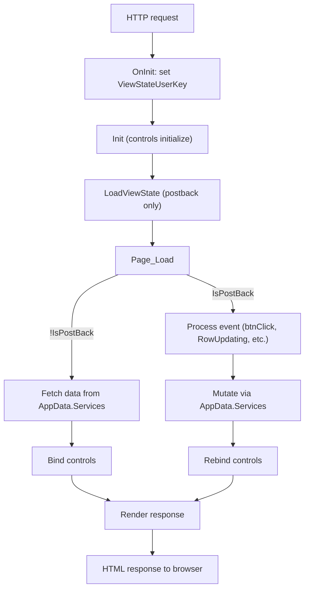
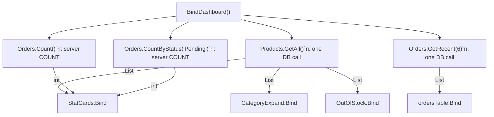
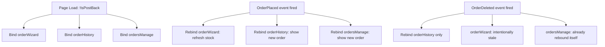
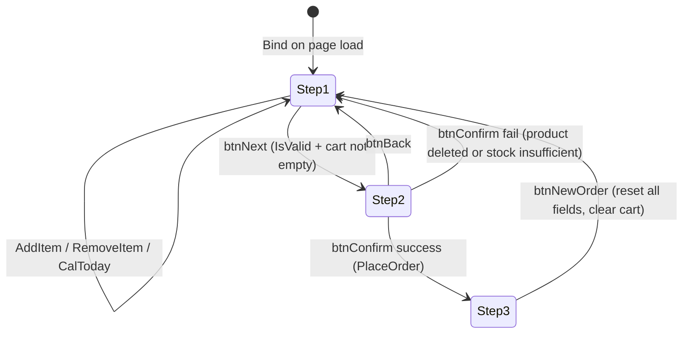
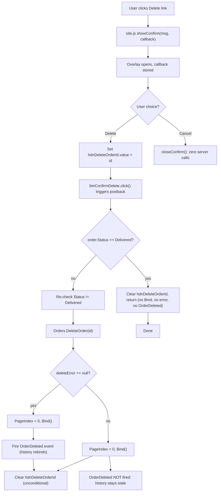

# Pages & Controls

← [Index](index.md)

Covers: `Layout/Site.Master`, `Pages/Default/`, `Pages/Products/`, `Pages/Orders/`, `Pages/Shared/`.

---

## WebForms Page Lifecycle (relevant events)



`!IsPostBack` guards in `Page_Load` prevent redundant DB fetches on postbacks. Controls re-bind only when their data may have changed (e.g., after a successful save or delete).

---

## Site.Master (`Layout/Site.Master`)

Master page for all three main pages. Provides:
- Responsive top nav with logo + three links (Dashboard / Products / Orders)
- `#confirmOverlay` modal div: used by `site.js` for delete confirmations
- `<asp:ContentPlaceHolder>` for page body

**Active nav link detection** (`SiteMaster.Page_Load`):

```csharp
var path = Request.AppRelativeCurrentExecutionFilePath.ToLower();
bool isDashboard = path.Contains("/default/") || path == "~/default.aspx" || path == "~/";
bool isProducts  = path.Contains("/products/") || path == "~/products.aspx";
bool isOrders    = path.Contains("/orders/")   || path == "~/orders.aspx";
```

Sets `class="nav-link active"` or `class="nav-link"` on each `<a runat="server">`.

---

## Dashboard (`Pages/Default/`)

`DefaultPage` inherits `AppPage`. `Page_Load` calls `BindDashboard()` on `!IsPostBack` only.

### Single-fetch pattern



`Products.GetAll()` is called **once** and its result is passed to StatCards, CategoryExpand, and OutOfStock: avoiding redundant product queries. However, StatCards makes two additional independent DB calls: `Orders.Count()` and `Orders.CountByStatus("Pending")`. Total dashboard load: **3 DB calls** (Products.GetAll + Orders.Count + Orders.CountByStatus) + 1 for `Orders.GetRecent(6)` = **4 DB calls**.

### StatCards (`Pages/Default/StatCards/StatCards.ascx`)

Receives `List<Product>` from `DefaultPage.BindDashboard()`.

| Card | Formula |
|------|---------|
| Total Products | `products.Count` |
| Low Stock | `products.Count(p => p.Stock > 0 && p.Stock <= 5)` |
| Total Orders | `Orders.Count()`: separate server-side COUNT |
| Pending Orders | `Orders.CountByStatus("Pending")`: server-side COUNT |

### CategoryExpand (`Pages/Default/CategoryExpand/CategoryExpand.ascx`)

Accordion: one section per `AppConstants.Categories` entry.

**Bind(products):** `Repeater` sourced from:
```csharp
AppConstants.Categories.Select(cat => new {
    Category     = cat,
    Count        = products.Count(p => p.Category == cat && p.IsActive && p.Stock > 0),
    Expanded     = ViewState["ExpandedCat"]?.ToString() == cat,
    ProductNames = products.Where(p => p.Category == cat && p.IsActive && p.Stock > 0)
                           .Select(p => p.Name).ToList()
})
```

**Toggle postback** (`CommandName="toggle"`, `CommandArgument=category`):
- Same category as `ViewState["ExpandedCat"]` → set to `null` (collapse).
- Different category → set to new category (expand).
- **Re-fetches from DB** via `AppData.Services.Products.GetAll()`: cannot reuse initial list since this is a separate postback request.

**Product filter:** only `IsActive && Stock > 0` products are counted and shown in expand rows.

**`GetProductList(names)`:** HTML-encoded names joined by `<br>`. Empty → `<span style='color:#9a9790'>No active products.</span>`.

### OutOfStock (`Pages/Default/OutOfStock/OutOfStock.ascx`)

Filters `products.Where(p => p.Stock == 0)`:

| Condition | Behavior |
|-----------|---------|
| 0 OOS items | `rptOutOfStock` bound to null, `pnlNoOos.Visible = true`, badge cleared |
| N OOS items | `rptOutOfStock` bound, `pnlNoOos.Visible = false`, `litOosCount = "<span class='badge b-oos' style='font-size:10px'>{N} item{s}</span>"`: uses proper singular/plural ("1 item" / "3 items"), includes inline `style='font-size:10px'` |

---

## Products (`Pages/Products/`)

`ProductsPage` inherits `AppPage`. Top-level field:
```csharp
private readonly ProductService _products = AppData.Services.Products;
```

### BindGrid() logic

All sorting (Name/Category/Price/Stock) and filtering (category, active status) is applied **in-memory** via LINQ on `List<Product>` after `GetAll()` fetches the full table. No sort/filter is pushed to SQL. Default sort: `Id ASC` (set in `Page_Load` on first load).

```mermaid
flowchart TD
    A{activeFilter value?}
    A -->|"'inactive'"| B["GetAll(includeDeleted: true)"]
    A -->|"'' or 'active'"| C["GetAll(includeDeleted: false)"]
    B --> D["productSummary.Bind(GetAll(false))"]
    C --> D
    D --> E{category filter?}
    E -->|cat selected| F["Where(p.Category == cat)"]
    E -->|All| G[no filter]
    F --> H{active filter?}
    G --> H
    H -->|active| I["Where(IsActive && Stock > 0)"]
    H -->|inactive| J["Where(!IsActive or Stock==0 or IsDeleted)"]
    H -->|All| K[no filter]
    I --> L["Sort by ViewState SortField/SortDir\n(Id/Name/Category/Price/Stock, ASC/DESC)"]
    J --> L
    K --> L
    L --> M["gvProducts.DataSource = list\nlblRowCount = '{N} product{N ≠ 1 ? \"s\" : \"\"}'"]
```

`productSummary.Bind` always receives `GetAll(false)` (active-only): summary counts are never distorted by the view filter.

### Inline Edit flow

1. `gvProducts_RowCreated`: if row is in edit mode, populate `ddlEditCategory` from `AppConstants.Categories`.
2. `gvProducts_RowEditing`: calls `productDetail.Hide()` before `BindGrid()`.
3. `gvProducts_RowUpdating`:
   - `GetById(id)` → null: `EditIndex = -1`, `BindGrid()`, silent return (no error).
   - Parse `txtEditPrice` via `decimal.TryParse`; reject if < 0. Parse `txtEditStock` via `int.TryParse`; reject if < 0.
   - Parse failure → `EditIndex = -1`, `BindGrid()` first (must run before label assignment), then `lblRowCount.Text = "Price must be a valid non-negative number. Update cancelled."`, return.
   - Stock parse failure → same pattern, message `"Stock must be a valid non-negative number. Update cancelled."`.
   - Success → build updated `Product`, call `_products.Update(p)`.
    - On exception → `_log.Error(...)`, show error in `lblRowCount` after `BindGrid()`.
   - `productDetail.Hide()` before `BindGrid()` on all paths (parse failure, success, exception).
4. `gvProducts_RowCancelingEdit`: standard GridView edit index management.

**Detail panel auto-close:** `ddlFilter_Changed`, `ddlPageSizeP_Changed`, and `gvProducts_RowEditing` all call `productDetail.Hide()`: detail panel closes silently when user changes filter, page size, or starts editing.

**Product status badge** (`GetStatusHtml` static helper: lives on `ProductsPage`, **not** `UiHelper`):

| Condition | HTML |
|-----------|------|
| `IsDeleted` | `<span class='badge badge-gray'>Deleted</span>` |
| `IsActive && Stock > 0` | `<span class='badge b-active'>Active</span>` |
| else | `<span class='badge badge-gray'>Inactive</span>` |

### ProductSummary (`Pages/Products/ProductSummary/ProductSummary.ascx`)

| Card | Formula |
|------|---------|
| Total | `products.Count` |
| Active | `products.Count(p => p.IsActive && p.Stock > 0)` |
| Low Stock | `products.Count(p => p.Stock > 0 && p.Stock <= 5)` |
| Out of Stock | `products.Count(p => p.Stock == 0)` |

Always receives active-only list: see `BindGrid()` above.

### AddProductPanel (`Pages/Products/AddProductPanel/AddProductPanel.ascx`)

Toggle: `lnkAddProduct_Click` flips `pnlAdd.Visible` and populates `ddlNewCategory` on open.

`btnSaveNew_Click`:
```
Page.IsValid
  → false: return (ASP.NET validators already show messages)
  → true:
      parse Price (decimal) and Stock (int); reject if < 0
      failure: show alert-warn, return
      IsActive = stock > 0 && chkNewActive.Checked
      Products.Add(new Product { ... })
       success: clear name/price/stock, reset category dropdown to index 0, reset active checkbox to `true`, show alert-success with "Product #{id} \"{Name}\" added.", fire ProductAdded
      exception: log Error, show alert-warn
```

On success, `pnlAdd.Visible` stays **true** (panel remains open for rapid entry). `btnCancelNew_Click` hides the panel without clearing fields: re-opening via toggle re-binds the category dropdown and hides the result label only.

`IsActive` formula: `stock > 0 && chkNewActive.Checked`: stock must be non-zero for the product to be active, regardless of checkbox state.

### ProductDetail (`Pages/Products/ProductDetail/ProductDetail.ascx`)

`Show(Product p)`: read-only panel. Null guard: if `product == null`, hides entire control silently (no stale/broken data):

| Field | Rendering |
|-------|-----------|
| Id | `product.Id.ToString()`: "Id: {N}"` |
| Name, Category | `HtmlEncode(value)` |
| Price | `p.Price.ToString("C")`: locale currency |
| Added Date | `p.AddedDate.ToString("d")`: short date |
| Stock badge | `== 0` → `b-oos "Out of stock"` / `<= 5` → `b-low "{N} units"` / else → plain `"{N} units"` |
| Status badge | `IsActive` → `b-active "Active"` / else → `badge-gray "Inactive"` |

`lnkCloseDetail_Click`: `pnlDetail.Visible = false`, fires `DetailClosed` event → parent clears `gvProducts.SelectedIndex`.

---

## Orders (`Pages/Orders/`)

### Orders.aspx: Coordinator

`OrdersPage` inherits `AppPage`. Owns three child controls: `orderWizard`, `orderHistory`, `orderManage`.



`OrderPlaced` rebinds **all three**: wizard needs fresh stock list, history + manage need the new order.  
`OrderDeleted` rebinds **only history**: manage already rebinds itself after deletion. The wizard is **not** rebound; its product dropdown reflects stock at bind time and stays stale until the next `OrderWizard.Bind()` call (next order placement or full page load). Stock restoration happens server-side via `DeleteOrder` but the wizard's in-memory list is not refreshed.

### OrderWizard (`Pages/Orders/OrderWizard/`)

Three-step wizard via `MultiView` (`mvOrder`). `SetStep(int step)`:

```csharp
mvOrder.ActiveViewIndex = step;
pnlStep1.CssClass = step == 0 ? "wt active" : "wt done";
pnlStep2.CssClass = step == 1 ? "wt active" : step > 1 ? "wt done" : "wt";
pnlStep3.CssClass = step == 2 ? "wt active" : "wt";
```

**Wizard state machine:**

**SetStep CSS classes:** `pnlStep1/2/3` use three classes: `"wt"` (future/not reached), `"wt active"` (current), `"wt done"` (past). Past steps get `"done"`, current gets `"active"`, future steps get bare `"wt"`. This creates a visual breadcrumb: e.g. at step 2, step 1 shows as completed.

**Step transitions:**



**`Bind()`** re-populates the product dropdown and resets the calendar. It does **not** clear the session cart: cart persists across page loads. Cart only clears in `btnConfirm_Click` (successful order) and `btnNewOrder_Click` (reset). This boundary means returning to the page preserves in-progress carts.

#### Step 1: Order Info

**Cart session key:** `const CartSessionKey = "CartItems"`: `List<OrderItem>` in `Session`.

**Add item** (`btnAddItem_Click`):
```
parse ddlProduct.SelectedValue → productId (return if 0)
GetById(productId) → product (return if null)
parse txtQty → qty (default 1 if invalid)
inCart    = CartItems.Where(i.ProductId == productId).Sum(i.Quantity)
available = product.Stock - inCart
if qty > available:
    show lblCartWarning (HTML-encoded product name)
    return
CartItems.Add(new OrderItem { ... })
BindCartItems()
BindProductDropDown()
```

**Warning message variants:**
- `available <= 0`: `"{Name} is already in your cart with no more stock available."`
- `available > 0`: `"Only {N} more unit(s) of {Name} available (already {M} in cart)."`

**Remove item** (`rptCart_ItemCommand`, `CommandName="remove"`):  
`FindIndex(i => i.ProductId == productId)`: find by `ProductId`, not list index, preventing corruption if multiple browser tabs share the same session.

**Duplicate items:** same product added twice creates **two separate** `OrderItem` entries (not merged). The stock check accounts for this: `inCart = CartItems.Where(i => i.ProductId == productId).Sum(i.Quantity)` sums all cart lines for the same product before validating against available stock.

**Calendar:**
- Wrapped in `UpdatePanel UpdateMode="Conditional"`.
- `btnCalToday` is `AsyncPostBackTrigger` → sets `SelectedDate + VisibleDate = DateTime.Today`, calls `upCalendar.Update()`.
- `cvDate_ServerValidate`: `SelectedDate != DateTime.MinValue && SelectedDate >= DateTime.Today`: past delivery dates are rejected server-side.

**Validation group:** all step-1 validators use `ValidationGroup="Step1"`. `btnNext` has `ValidationGroup="Step1"`. `btnAddItem`, remove buttons, `btnCalToday` have `CausesValidation="false"`.

#### Step 2: Review & Confirm

`btnNext_Click` populates all `litRev*` literals (HtmlEncoded). Extras: comma-joined or "None".

`btnConfirm_Click`:
0. `if (items.Count == 0) return;`: early guard (redundant with step 2 check, present as defense-in-depth).
1. Re-fetches each product → fail if `null || IsDeleted` → warn + `SetStep(0)`.
2. Check `product.Stock < item.Quantity` → warn + `SetStep(0)`.
3. **Re-price**: `item.UnitPrice = product.Price`: prevents stale session price.
4. Build `Order`: `Status = Pending`, `Priority = rblPriority.SelectedValue`, `Extras = SelectedExtras()`, `Items = cart`.
5. `Orders.PlaceOrder(order)` → on exception: log + warn + `SetStep(0)`.
6. Populate `litConf*` literals using the **local `total` variable** (calculated in the re-price loop above): not `order.Total` from `PlaceOrder` (which also sets it via `order.Total = Items.Sum(...)` but the confirm handler uses its own sum). `trConfExtras` (hidden by default) shown only if `order.Extras.Count > 0`.
7. `SetStep(2)`: renders confirmed view.
8. `CartItems = new List<OrderItem>()`.
9. `OrderPlaced.Invoke(...)`.

Note: `litConfTotal` uses `"{0:F2}"` (no `$` prefix) → "42.50", while `litRevTotal` uses `"${0:F2}"` → "$42.50": this asymmetry is intentional (review shows price prefix, confirmed shows raw number).

`btnNewOrder_Click` resets all fields (name, email, qty=1, extras unchecked, priority=Normal, calendar=today), clears session cart, then **rebinds cart and dropdown** (`BindCartItems()` + `BindProductDropDown()`) to reflect the cleared state, then `SetStep(0)`.

#### Step 3: Confirmed

Read-only display of `#{orderId}`, item list, totals (`litConfTotal` uses local `total`), and customer info. The `btnNewOrder_Click` reset action is documented under Step 2 above.

#### SelectedExtras()

```csharp
private List<string> SelectedExtras()
{
    var list = new List<string>();
    foreach (ListItem item in cblExtras.Items)
        if (item.Selected) list.Add(item.Text);
    return list;
}
```

Extras in markup: "Gift wrap", "Express delivery".

---

### OrderHistory (`Pages/Orders/OrderHistory/`)

Wraps `OrdersTable` with `ShowDeleted = true`. Shows deleted orders with visual dimming (`opacity:0.45; text-decoration:line-through`) and "Deleted" badge.

In contrast, `OrdersManage` uses `GetAll(false, status)` which **excludes** deleted orders. Both controls appear on the same `Orders.aspx` page: history is the full audit view, manage is the active-order management view.

| Constant | Value |
|----------|-------|
| `HistoryPageSize` | `10` |
| Page state key | `ViewState["HistoryPage"]` (0-based int) |

`Bind()`:
1. `total = Orders.Count(ShowDeleted, null)`.
2. `pages = (int)Math.Ceiling(total / 10.0)`.
3. Page clamp: three guards (not a range clamp):
   - `if (pages == 0) HistoryPage = 0`: explicit zero-orders guard (prevents impossible `[0, -1]` range).
   - `else if (HistoryPage >= pages) HistoryPage = pages - 1`: correct to last page after deletion reduces count.
   - `if (HistoryPage < 0) HistoryPage = 0`: defensive underflow guard.
4. `GetPaged(HistoryPage * 10, 10, ShowDeleted, null)` → `ordersTable.Bind(page)`.
5. `lblHistPage.Text = pages > 0 ? $"{page+1} / {pages}" : ""`.
6. `lnkHistPrev.Visible = HistoryPage > 0`, `lnkHistNext.Visible = HistoryPage < pages-1`.
7. `upHistory.Update()`: pagination rendered inside `UpdatePanel`.

### OrdersManage (`Pages/Orders/OrdersManage/`)

Full GridView with sort, filter, page size, inline edit, and soft-delete.

**Default sort:** `OrderDate DESC` (via `ViewState["OrderSortField"] ?? "OrderDate"` + `"OrderDir" ?? "DESC"`).

**Items cache:** `Dictionary<int, List<OrderItem>> _itemsCache` built in `Bind()` as `orders.ToDictionary(o => o.Id, o => o.Items)`. `GetItemNames(id)` hits cache first, falls back to `Services.Orders.GetItems(id)`.

**Filters + sorting:**

| Control | Default | Effect |
|---------|---------|--------|
| `ddlStatusFilter` | `""` (All) | Passes as `status?` param to `GetAll` |
| `ddlPageSizeO` | 5 | `GridView.PageSize` |
| `ViewState["OrderSortField"]` | `"OrderDate"` | Sort column |
| `ViewState["OrderDir"]` | `"DESC"` | ASC / DESC |

Sort switch (in-memory LINQ): CustomerName / Total / Status / Priority / OrderDate / Id. `GetAll` returns the full unsorted dataset; category/active filters and sort are all applied in-memory after the DB fetch.

**`RowDataBound` logic:**
- Edit rows: `ddlEditStatus.FindByValue(currentStatus)` / `ddlEditPriority.FindByValue(currentPriority)` to pre-select dropdowns.
- Read rows: find `LinkButton` with `CommandName == "Delete"`:
  - `Status == Delivered` → `lb.Enabled = false`, `lb.Style["text-decoration"] = "none"`, `lb.Style["color"] = "#ccc"`, `lb.ToolTip = "Delivered orders cannot be deleted"`.
  - Else → `lb.OnClientClick = $"showConfirm('...#{id}...', function(){{ hdnDeleteOrderId.value='{id}'; btnConfirmDelete.click(); }}); return false;"`.

**Deletion flow:**



**Error path:** on `DeleteOrder` failure, `Bind()` still runs (grid reflects current DB state), but `OrderDeleted` is not fired → `Orders.aspx` does not rebind `orderHistory` → history view stays stale until next full page load or successful deletion. `hdnDeleteOrderId.Value = ""` runs unconditionally regardless of outcome.

Inline edit update (`gvOrders_RowUpdating`): `GetById(id)` → null → `EditIndex = -1`, `BindGrid()`, silent return. Otherwise reads `ddlEditStatus` + `ddlEditPriority`, calls `Orders.UpdateStatus(id, status, priority)`. Error displayed *after* `Bind()` to survive grid rebind.

**`gvOrders_RowDeleting`:** `e.Cancel = true`: the built-in GridView delete command is intercepted and killed. Actual deletion routes through the `hdnDeleteOrderId` hidden field + `btnConfirmDelete` hidden button pattern described in the deletion flow above.

---

## Shared Controls

### OrdersTable (`Pages/Shared/OrdersTable/OrdersTable.ascx`)

Reusable `Repeater`-based order display. Used by `OrderHistory` and referenced by `OrdersManage`.

Property: `bool ShowDeleted` (default false in most contexts; `true` in OrderHistory).

`Bind(IEnumerable<Order> orders)`: builds `_itemsCache`, binds `rptTable`.

**Render helpers** (called from markup with `<%# %>` binding expressions):

| Helper | When ShowDeleted && deleted | When not deleted |
|--------|-----------------------------|-----------------|
| `RowStyle(isDeletedObj)` | `"opacity:0.45;text-decoration:line-through"` | `""` |
| `StatusBadge(isDeletedObj, statusObj)` | `UiHelper.GetStatusBadge("Deleted")` | `UiHelper.GetStatusBadge(status)` |
| `ItemNames(orderId)` | cache → `GetItems` fallback | same |

### PageHeader (`Pages/Shared/PageHeader/PageHeader.ascx`)

```csharp
public string Title    { get; set; }
public string Subtitle { get; set; }
```

Renders as a `<div class="page-header">` block. Used on all three main pages.

### EventModels (`Models/EventModels.cs`)

| Class | Properties | Used by |
|-------|-----------|---------|
| `ProductEventArgs` | `ProductId`, `ProductName` | `AddProductPanel.ProductAdded` |
| `OrderEventArgs` | `OrderId` | `OrderWizard.OrderPlaced` |
