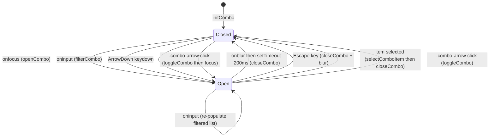
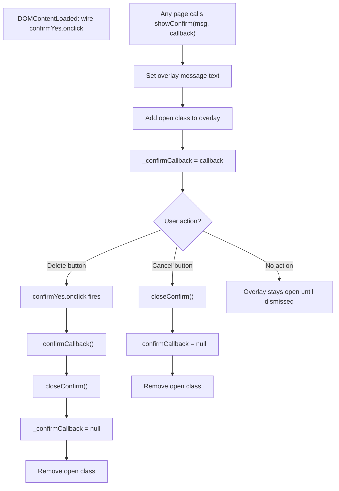

# Frontend, JS, Helpers & Shared UI

← [Index](index.md)

Covers: `Scripts/site.js`, `Pages/Orders/OrderWizard/combo.js`, `Helpers/UiHelper.cs`, `Helpers/GridViewHelper.cs`, UpdatePanel regions, CSS badge reference.

---

## JavaScript

### combo.js (`Pages/Orders/OrderWizard/combo.js`)

Co-located with `OrderWizard.ascx`. Not in `Scripts/`: loaded relatively:

```html
<script src='<%= ResolveUrl("./combo.js") %>'></script>
```

Re-initialized after every async postback:

```javascript
// in OrderWizard.ascx inline script
Sys.WebForms.PageRequestManager.getInstance().add_endRequest(function () {
    initCombo('comboProduct');
});
```

Input value is preserved across partial updates by reading `input.value` before `initCombo` clears it and restoring it after.

#### State machine



The combo starts closed and opens on focus, input, or ArrowDown. Once open, it filters options as the user types, highlights items on ArrowUp/Down, and selects on Enter. It closes on Escape, item selection, or blur (with a 200ms delay to allow click-based selection). Clicking the arrow toggles between open and closed.

#### Function reference

| Function | Signature | Action |
|----------|-----------|--------|
| `initCombo` | `(id)` | Read options into `wrap._allOpts`; wire all events; clear input |
| `openCombo` | `(id)` | `populateCombo` + add `"open"` class to `.combo-list`; reset `_activeIndex = -1` |
| `closeCombo` | `(id)` | Remove `"open"` class; reset `_activeIndex = -1` |
| `toggleCombo` | `(id)` | Close if open; else focus input: `openCombo` fires indirectly via `input.onfocus`, not called directly by `toggleCombo` |
| `filterCombo` | `(id)` | `populateCombo` + ensure list is open |
| `populateCombo` | `(id)` | Rebuild `.combo-list` from `_allOpts` filtered by `input.value.toLowerCase()`. If no options match, renders `<div class='combo-empty'>No products found</div>` |
| `selectComboItem` | `(id, value, text)` | Set `input.value = text`; scan `sel.options` for matching value and set `select.selectedIndex`; `closeCombo`. If value not found (e.g., product removed from underlying `<select>` since last `initCombo`), loop completes without setting selectedIndex: silent no-op |
| `comboKeydown` | `(e, id)` | Null guard: if `wrap` or `.combo-list` not found, return immediately. Otherwise dispatch ArrowDown / ArrowUp / Enter / Escape |
| `setHighlight` | `(items, wrap)` | Add `active` class + `scrollIntoView({block:'nearest'})` to `_activeIndex` item |

#### Key implementation details

**`onblur` 200ms delay**: prevents `closeCombo` from firing before `onmousedown` on a list item:
```javascript
input.onblur = function () { setTimeout(function () { closeCombo(id); }, 200); };
```

**`onmousedown` with `e.preventDefault()`**: prevents the blur from triggering at all when the user clicks a list item:
```javascript
div.onmousedown = function (e) {
    e.preventDefault();   // ← blocks input.onblur
    selectComboItem(id, val, txt);
};
```

Without `preventDefault`, clicking a list item would: fire `mousedown` → fire `blur` on input → 200ms timer starts → `mouseup` → `click` on item. The 200ms gives enough time for `selectComboItem` to run before `closeCombo` fires, but `preventDefault` eliminates the race entirely.

**Options filtering**: `initCombo` excludes:
- `value === ""` (placeholder)
- `text.indexOf('--') === 0` (ASP.NET placeholder format)
- `value === text` (degenerate entries)

**Keyboard matrix:**

| Key | List closed | List open, no items | List open, items, index == -1 | List open, items, index >= 0 |
|-----|-------------|--------------------|-----------------------------|------------------------------|
| ArrowDown | Open list | none | index → 0, highlight | index++, clamp, highlight |
| ArrowUp | none | none | none | index--, min 0, highlight |
| Enter | none | none | none | selectComboItem |
| Escape | none | Close + blur | Close + blur | Close + blur |

---

### site.js (`Scripts/site.js`)

Global confirm dialog. Loaded by `Site.Master`: available on all pages.

#### Flow



The overlay replaces `confirm()`: `showConfirm(msg, callback)` opens it with a message, and clicking Delete executes the stored callback (typically triggering a hidden button postback). Clicking Cancel or doing nothing calls `closeConfirm()` with zero server interaction. The overlay is outside `<form runat="server">` so it doesn't interfere with ViewState.

The overlay `<div>` has no onclick: clicking the background does nothing. Dismissal requires clicking the Cancel button (markup: `onclick="closeConfirm()"`).

**Form boundary:** the overlay, Cancel button, and Delete button are all **outside** `<form runat="server">` in `Site.Master`. The Delete button fires `_confirmCallback`, which calls `btnConfirmDelete.click()`: a button inside the form: triggering a postback.

#### API

```javascript
showConfirm(msg, callback)   // open overlay with message; store callback
closeConfirm()               // remove "open" class; null out callback
```

`confirmYes.onclick` is wired once in `DOMContentLoaded`: not re-wired on UpdatePanel refreshes (the overlay is outside all UpdatePanels, in `Site.Master`).

`_confirmCallback` is a module-level var: not on `window`: preventing accidental external invocation.

---

## Helpers

### UiHelper (`Helpers/UiHelper.cs`)

Static class. All methods return HTML strings: output is always encoded.

#### GetStatusBadge

```csharp
public static string GetStatusBadge(string status)
```

| Status constant | CSS class | Display text |
|----------------|-----------|-------------|
| `AppConstants.OrderStatus.Delivered` | `b-delivered` | Delivered |
| `AppConstants.OrderStatus.Shipped` | `b-shipped` | Shipped |
| `AppConstants.OrderStatus.Processing` | `b-processing` | Processing |
| `AppConstants.UiLabels.Deleted` | `badge-gray` | Deleted |
| Pending / anything else | `b-pending` | (status value) |

**Null safety:** if `status` is null, `HttpUtility.HtmlEncode` produces `""`; all equality checks fail (null reference inequality, not string equality); falls through to `b-pending` with empty display text: renders an empty amber badge silently.

All comparisons use `AppConstants.*`: no inline string literals.  
Return: `<span class='badge {css}'>{HttpUtility.HtmlEncode(status)}</span>`

#### FormatItemNames

```csharp
public static string FormatItemNames(IEnumerable<OrderItem> items)
```

Per item: `Quantity > 1 ? "{Name} x{Qty}" : "{Name}"`: name is `HtmlEncode`d.  
Items joined by `"<br/>"`.

Used in `OrdersTable` and `OrdersManage` item name cells.

### GridViewHelper (`Helpers/GridViewHelper.cs`)

Static class. Encapsulates sort arrow rendering and direction toggling, eliminating duplicated code across `gvProducts` and `gvOrders`.

#### ApplySortArrow

```csharp
public static void ApplySortArrow(
    GridView gv, GridViewRowEventArgs e,
    string fieldKey, string dirKey, StateBag viewState)
```

- Returns immediately if `e.Row.RowType != DataControlRowType.Header`.
- `field == null` early exit: `viewState[fieldKey] as string; if (field == null) return;`: no arrow drawn if sort field not yet in ViewState. On first `RowCreated` before `Bind()` sets ViewState, this guard fires.
- Reads `viewState[fieldKey]` (current sort field) and `viewState[dirKey]` (ASC/DESC).
- Finds column where `c.SortExpression == sortField`.
- Appends `" &#8593;"` (↑) for ASC or `" &#8595;"` (↓) for DESC.
- Target: `((LinkButton)cell.Controls[0]).Text` if first control is a `LinkButton`, else `cell.Text`.

#### ToggleSortDirection

```csharp
public static void ToggleSortDirection(
    GridViewSortEventArgs e,
    string fieldKey, string dirKey, StateBag viewState)
```

| Condition | Action |
|-----------|--------|
| `e.SortExpression == current field` | Toggle ASC ↔ DESC |
| Different field | Store new field; reset direction to ASC |

Called from `gvProducts_Sorting` and `gvOrders_Sorting`.

---

## UpdatePanel Regions

Partial-page updates via ASP.NET `ScriptManager` + `UpdatePanel`:

| Control | Panel ID | `UpdateMode` | Trigger |
|---------|----------|-------------|---------|
| `OrderWizard`: calendar | `upCalendar` | `Conditional` | `btnCalToday` (AsyncPostBackTrigger) |
| `OrderHistory`: pagination | `upHistory` | `Conditional` | `lnkHistPrev`, `lnkHistNext` + explicit `upHistory.Update()` |
| `OrdersManage`: grid | `upOrders` | `Conditional` | `btnConfirmDelete` + explicit `upOrders.Update()` |

All other postbacks are full-page. `UpdatePanel`s are intentionally minimal: only calendar date selection, history paging, and order manage grid avoid full-page refreshes.

`combo.js` re-initializes on every `endRequest` because async postbacks can replace the `ddlProduct` options server-side, invalidating the `_allOpts` cache.

---

## CSS Badge Classes

All badge classes defined in `Content/Site.css`. Used by `UiHelper.GetStatusBadge`, `GetStatusHtml` (static method on `ProductsPage`, not in `UiHelper`), and stock badges in `ProductDetail` / `OutOfStock`.

| Class | Context | Color (approximate) |
|-------|---------|---------------------|
| `b-pending` | Order: Pending | Amber / yellow |
| `b-processing` | Order: Processing | Blue |
| `b-shipped` | Order: Shipped | Purple |
| `b-delivered` | Order: Delivered | Green |
| `badge-gray` | Deleted / Inactive | Gray |
| `b-active` | Product: Active | Green |
| `b-oos` | Product: Out of stock | Red |
| `b-low` | Product: Low stock (1–5) | Orange |

Badge HTML template: `<span class='badge {class}'>{text}</span>`

Product stock badge thresholds:
- `Stock == 0` → `b-oos`
- `Stock > 0 && Stock <= 5` → `b-low`
- `Stock > 5` → no badge (plain text)

---

## Static Assets

| File | Detail |
|------|--------|
| `favicon.ico` | 32×32 ICO: bold "I" on beige background. Referenced via `<link rel="shortcut icon" href="favicon.ico">` in `Site.Master`. |
| `.vscode/settings.json` | Excludes `bin/`, `obj/`, `App_Data/` from VS Code file explorer. |

