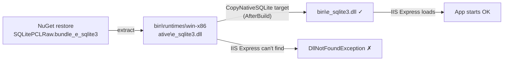
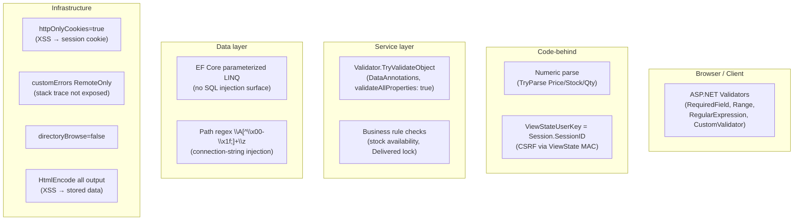

# Configuration, Security & Deployment

← [Index](index.md)

Covers: `web.config`, `LegacyWebForms.csproj`, `Pages/Errors/ErrorPage.aspx`, security model, deployment checklist, critical constraints.

---

## web.config

### AppSettings

| Key | Value | Usage |
|-----|-------|-------|
| `DbPath` | `~/App_Data/inventory.db` | Read in `Global.asax Application_Start`; resolved to physical path |
| `ValidationSettings:UnobtrusiveValidationMode` | `None` | **Required**: ASP.NET validators won't render client-side without jQuery unless this is `None` |

### system.web

| Setting | Value | Why |
|---------|-------|-----|
| `compilation debug` | `true` | Dev config: set `false` for production |
| `httpCookies httpOnlyCookies` | `true` | Session cookie inaccessible to JavaScript |
| `globalization` | `responseEncoding/fileEncoding/requestEncoding = utf-8` | Consistent encoding stack-wide |
| `customErrors mode` | `RemoteOnly` | Full errors shown on localhost; generic page shown to remote clients |
| `customErrors defaultRedirect` | `~/Pages/Errors/ErrorPage.aspx` | All unhandled exceptions |
| `error statusCode="404"` | `~/Pages/Errors/ErrorPage.aspx` | 404s redirected to same error page |
| `sessionState mode` | `InProc` (default) | `[Serializable]` on `OrderItem` future-proofs for StateServer/SQLServer |

### system.webServer

| Setting | Value | Why |
|---------|-------|-----|
| `directoryBrowse` | `false` | Prevents directory listing |
| `defaultDocument` | `Pages/Default/Default.aspx` | Root URL (`/`) resolves to dashboard |
| `runAllManagedModulesForAllRequests` | `false` | Only applies managed pipeline to paths that need it: performance |

### system.web / hostingEnvironment

| Setting | Value | Why |
|---------|-------|-----|
| `shadowCopyBinAssemblies` | `false` | **Critical**: SQLite native DLL (`e_sqlite3.dll`) cannot be located at runtime when shadow copy is enabled |

### Assembly Binding Redirects (24 entries)

All required because EF Core 3.1.32 pulls in specific versions of shared dependencies; `net48` ships older versions via GAC:

| Assembly | Redirected to |
|----------|--------------|
| `Microsoft.Extensions.Caching.*` | 3.1.32.0 |
| `Microsoft.Extensions.Configuration.*` | 3.1.32.0 |
| `Microsoft.Extensions.DependencyInjection.*` | 3.1.32.0 |
| `Microsoft.Extensions.Logging.*` | 3.1.32.0 |
| `Microsoft.Extensions.Options.*` | 3.1.32.0 |
| `Microsoft.Extensions.Primitives` | 3.1.32.0 |
| `SQLitePCLRaw.core` | 2.1.6.2060 |
| `SQLitePCLRaw.provider.e_sqlite3` | 2.1.6.2060 |
| `System.ComponentModel.Annotations` | 4.2.1.0 |
| `System.Threading.Tasks.Extensions` | 4.2.0.1 |
| `System.Runtime.CompilerServices.Unsafe` | 4.0.6.0 |
| `System.Buffers` | 4.0.3.0 |
| `System.Memory` | 4.0.1.1 |
| `System.Numerics.Vectors` | 4.1.4.0 |
| `System.Collections.Immutable` | 1.2.5.0 |
| `System.Diagnostics.DiagnosticSource` | 4.0.5.0 |
| `Microsoft.Bcl.AsyncInterfaces` | 1.0.0.0 |
| `Microsoft.Bcl.HashCode` | 1.0.0.0 |

Missing or wrong redirect version → `FileLoadException` or `MissingMethodException` at runtime.

---

## LegacyWebForms.csproj

### Key Properties

```xml
<PropertyGroup>
  <TargetFramework>net48</TargetFramework>
  <LangVersion>latest</LangVersion>
  <Nullable>enable</Nullable>
  <OutputType>Library</OutputType>           <!-- WebForms = DLL not EXE -->
  <OutputPath>bin\</OutputPath>
  <AppendTargetFrameworkToOutputPath>false</AppendTargetFrameworkToOutputPath>
  <AppendRuntimeIdentifierToOutputPath>false</AppendRuntimeIdentifierToOutputPath>
  <WarningLevel>5</WarningLevel>             <!-- strictest -->
</PropertyGroup>
```

`OutputType=Library`: WebForms projects compile to a DLL loaded by IIS/IIS Express, not a self-hosted executable.

### NuGet Packages

| Package | Version | Notes |
|---------|---------|-------|
| `Microsoft.EntityFrameworkCore` | 3.1.32 | Last version supporting `net48` |
| `Microsoft.EntityFrameworkCore.Sqlite` | 3.1.32 | Matches core version exactly |
| `SQLitePCLRaw.bundle_e_sqlite3` | 2.1.6 | Supplies native `e_sqlite3.dll` |

**Do not upgrade** EF Core past 3.1.x: EF Core 5+ dropped `net48` support.

### Framework References

System, System.Core, System.Data, System.Drawing, System.Web, System.Web.ApplicationServices, System.Web.DynamicData, System.Web.Entity, System.Web.Extensions, System.Web.Services, System.Xml, System.Configuration.

### CopyNativeSQLite MSBuild Target

```xml
<Target Name="CopyNativeSQLite" AfterTargets="Build">
  <Copy SourceFiles="$(OutputPath)runtimes\win-x86\native\e_sqlite3.dll"
        DestinationFolder="$(OutputPath)"
        SkipUnchangedFiles="true" />
</Target>
```

**Why:** NuGet places the native DLL in `bin\runtimes\win-x86\native\`. IIS Express resolves native DLLs from `bin\` root only: not subdirectories. Without this copy, `SQLitePCLRaw` throws `DllNotFoundException` at startup.



---

## Error Handling

### ErrorPage (`Pages/Errors/ErrorPage.aspx`)

`Page_Load`:
```csharp
Response.StatusCode = 500;
```

Serves as both the `customErrors defaultRedirect` (500) and the `statusCode="404"` redirect target: both paths produce HTTP 500 with a generic error page. The status code is set server-side, not by the redirect.

### Application_Error (`Global.asax.cs`)

```
Server.GetLastError()
  → .GetBaseException()          // unwrap HttpUnhandledException / AggregateException
  → AppData.Services?.Log.Error(Request.RawUrl, baseEx)
```

Fires before `customErrors` redirect. Logs RawUrl + full exception to `App_Data/logs/app.log`. Null-safe on `Services`: won't throw if initialization failed before `Services` was assigned.

### Log File

`App_Data/logs/app.log`: plain text, one entry per call to `Trace.TraceXxx`. Format added by `TextWriterTraceListener` with `TraceOptions.DateTime`:

```
LegacyWebForms Information: 0 : Adding product: Widget  [datetime]
LegacyWebForms Error: 0 : Unhandled error on /Orders | System.Exception: ...  [datetime]
```

`Trace.AutoFlush = true`: writes are flushed immediately, no buffering. Safe for crash analysis.

---

## Security Model

### Multi-layer defense summary



### Attack surface coverage

| Threat | Mitigation |
|--------|-----------|
| **XSS** | All dynamic output via `<%#:` (encoded binding) or `HttpUtility.HtmlEncode`. No raw `Eval()` in markup. |
| **CSRF** | `AppPage.OnInit`: `ViewStateUserKey = Session.SessionID`: ViewState HMAC key includes session ID; forged cross-session postbacks fail MAC check. |
| **SQL injection** | EF Core parameterized LINQ throughout. No raw SQL, no `string.Format` for query construction. |
| **Connection-string injection** | `AppData.Initialize` validates `dbPath` against `\A[^\x00-\x1f;]+\z`: rejects `;` and all control characters (newlines would allow `Attach` directives). |
| **Input validation bypass** | Three layers: ASP.NET validators → parse → `DataAnnotations`. Service layer validation fires even without UI. |
| **Business rule bypass** | Delivered-order delete blocked at UI (`RowDataBound` disables button) AND server (`btnConfirmDelete_Click` re-checks before calling service). |
| **Stale price manipulation** | `btnConfirm_Click` re-fetches and re-prices each product at confirm time: session price cannot be tampered with. |
| **Information disclosure** | `customErrors mode="RemoteOnly"`. Errors logged server-side only. `directoryBrowse=false`. |
| **Cookie theft via JS** | `httpOnlyCookies=true`: session cookie flag `HttpOnly` set. |

---

## Critical Constraints

These constraints are non-negotiable: violating any causes runtime failures:

| Constraint | Reason |
|-----------|--------|
| EF Core ≤ 3.1.x | EF Core 5+ dropped `net48` |
| `EnsureCreated()` only: never `Migrate()` | No migration history table; `Migrate()` will fail |
| `shadowCopyBinAssemblies = false` | SQLite native DLL not found under shadow copy |
| `CopyNativeSQLite` MSBuild target must run | IIS Express only searches `bin\` root for native DLLs |
| 24 assembly binding redirects in `web.config` | `FileLoadException` without exact versions |
| `HasConversion<int>()` on `bool` columns | SQLite has no BOOLEAN type; EF must map to INTEGER |
| `HasConversion` for `Extras` (`\|` delimiter) | Pipe avoids conflicts with comma-containing strings |
| `ValidationSettings:UnobtrusiveValidationMode = None` | ASP.NET validators require this without jQuery |
| `OutputType = Library` | WebForms uses IIS hosting: not self-hosted |

---

## Deployment Checklist

### Build

- [ ] `dotnet build` (or F5 in VS) completes without errors
- [ ] `bin\e_sqlite3.dll` exists (CopyNativeSQLite target ran)
- [ ] `bin\runtimes\win-x86\native\e_sqlite3.dll` also exists (source for target)

### First run

- [ ] `App_Data/` directory writeable by IIS app pool identity
- [ ] `App_Data/inventory.db` created by `EnsureCreated()` (auto on first request)
- [ ] `App_Data/logs/` created by `Application_Start` (auto)
- [ ] Dashboard loads with seeded data (12 products, 12 orders)

### Configuration checklist

- [ ] `DbPath` AppSetting present in `web.config`
- [ ] `shadowCopyBinAssemblies="false"` in `<hostingEnvironment>`
- [ ] `ValidationSettings:UnobtrusiveValidationMode` = `None`
- [ ] All 24 assembly binding redirects present (copy from source)
- [ ] `compilation debug="false"` for production

### IIS Express (dev)

IIS Express uses `.vs/config/applicationhost.config` or `launchSettings.json`. No additional configuration needed beyond the above: `defaultDocument` in `web.config` handles root URL routing.

### Production IIS

- Application pool: `.NET CLR v4.0`, `Integrated` pipeline
- App pool identity must have read/write on `App_Data/`
- `web.config` `compilation debug="false"`
- Ensure `e_sqlite3.dll` survives deployment (not excluded by publish profile)

