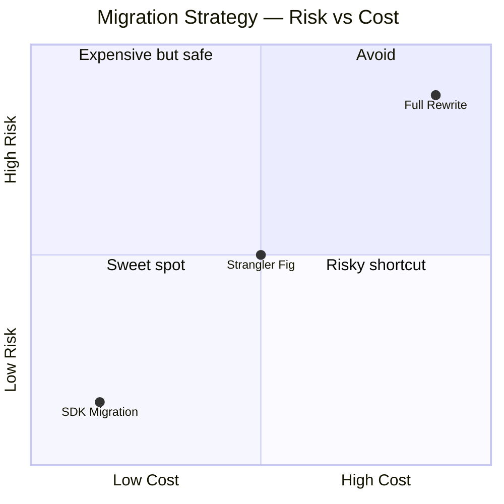
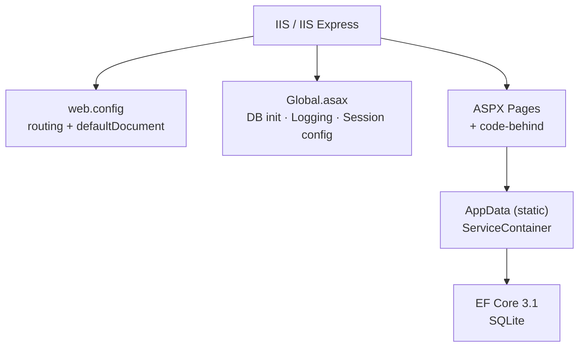
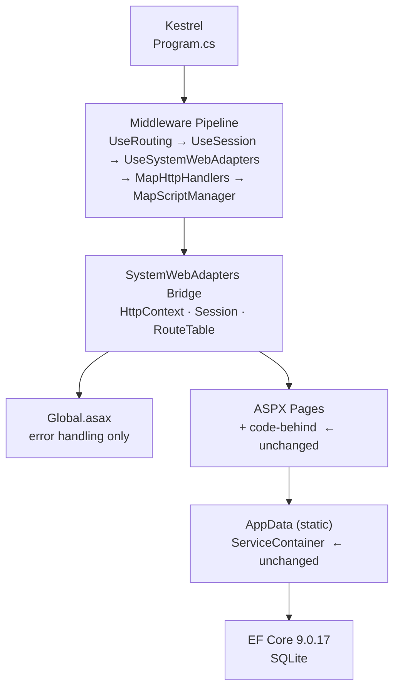
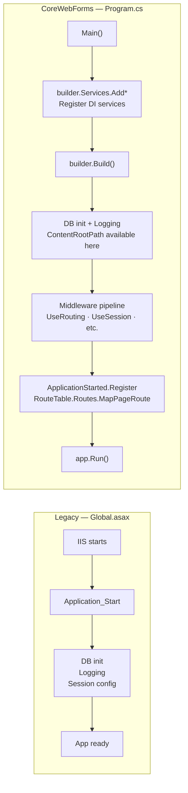
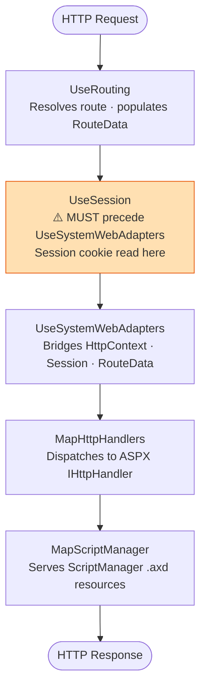
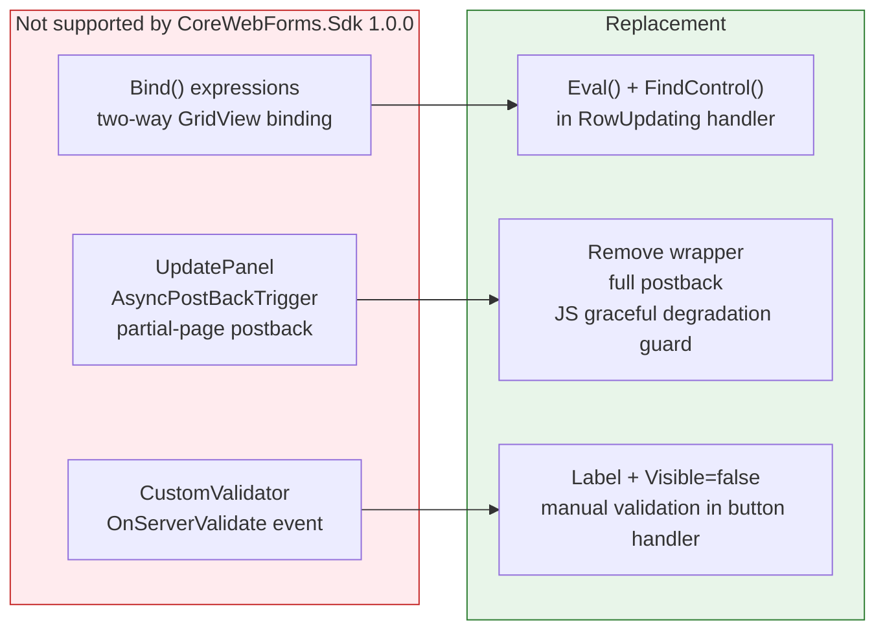
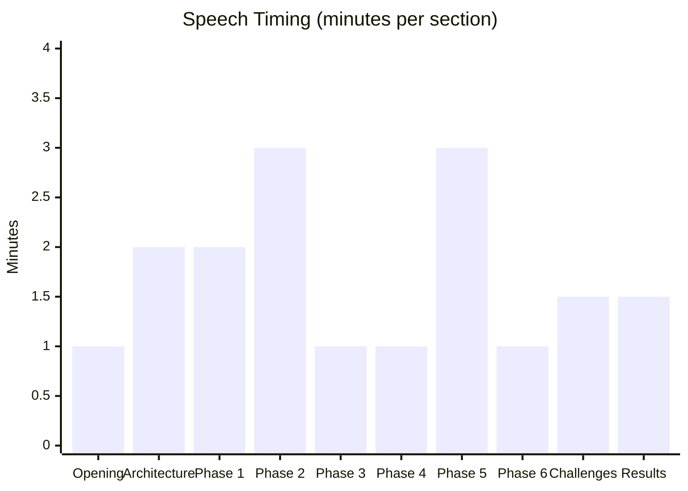

# Migration Interview Speech — ASP.NET WebForms to .NET 9

**Format**: Spoken script with timing, diagrams, pause points, and Q&A branches.
**Target duration**: 15–20 minutes.
**How to use**: Follow the `[~Xmin]` markers to pace yourself. At `[⏸ PAUSE]` points slow down and invite questions. `[➡ IF ASKED]` sections are ready-to-use branches for follow-ups.

---

## Opening — Why this migration existed `[~1 min]`

*Start confident. Set the stage before touching any technical details.*

> "So I want to talk about a migration I did — moving a legacy ASP.NET WebForms 4.8 application over to ASP.NET Core on .NET 9.
>
> The app itself was an inventory management system. Products, orders, a dashboard — about 15 ASPX pages and user controls, EF Core for data access, SQLite as the database. Nothing huge, but honestly that makes it a pretty good example of the kind of codebase a lot of companies have been sitting on for a decade.
>
> The driver was simple. .NET Framework 4.8 is in maintenance-only mode — no new features, no performance work, no cloud-native story. The app couldn't run on Linux, couldn't be containerised, and every dependency was pinned to ancient versions. So the question wasn't really *whether* to migrate. It was *how*."

`[⏸ PAUSE — let interviewer react or nod]`

---

## The Decision — Why Not a Full Rewrite `[~2 min]`

*Show architectural thinking. Most interviewers want to hear trade-off reasoning.*

> "The obvious first question is: why not just rewrite it?
>
> A full rewrite means replacing all those ASPX pages with Razor Pages or Blazor, rewriting all the code-behind logic, and retesting the whole thing from scratch. And while the app is running on the old system the entire time. That's expensive, it's risky, and your feature velocity goes to zero for months.
>
> We went with a third option — `CoreWebForms.Sdk`. It's a Microsoft-backed project that lets you keep your ASPX files and code-behind almost entirely intact, but run them on ASP.NET Core with Kestrel."



> "The way it works is through a compatibility bridge called `SystemWebAdapters`. It provides all the `System.Web.*` types that WebForms code depends on — `HttpContext`, `HttpRequest`, `Session`, `RouteTable` — but backed by ASP.NET Core internals. So when your code-behind calls `Session["Cart"]`, the adapter translates that to `IDistributedCache` under the hood. Your code doesn't change."

`[⏸ PAUSE]`

`[➡ IF ASKED: "What is SystemWebAdapters exactly?"]`

> "It's a NuGet package — `Microsoft.AspNetCore.SystemWebAdapters` — that ships compatible re-implementations of the old `System.Web` types. When your code-behind does `HttpContext.Current.Session`, instead of hitting in-process ASP.NET session, it goes through the adapter layer to ASP.NET Core's session middleware. The goal is zero changes in the business logic."

---

## The Architecture — Before and After `[~2 min]`

*Draw this if you're at a whiteboard. If remote, describe it and reference the diagram.*

> "Let me show you what the architecture looked like before and after, because the difference explains a lot of the decisions we made downstream."

**Before — Legacy WebForms:**



**After — CoreWebForms on ASP.NET Core:**



> "The ASPX pages and code-behind are essentially untouched. All the plumbing around them changed."

`[⏸ PAUSE]`

---

## Phase 1 — Swapping the Project File `[~2 min]`

*Sounds simple but has several gotchas worth mentioning.*

> "The migration itself happened in six phases. Phase one was swapping the project file — and this is where the whole thing either works or doesn't.
>
> The legacy `.csproj` used `Microsoft.NET.Sdk` targeting `net48`. We replaced it with `CoreWebForms.Sdk` targeting `net9.0`.

```xml
<!-- Before -->
<Project Sdk="Microsoft.NET.Sdk">
  <PropertyGroup>
    <TargetFramework>net48</TargetFramework>
    <OutputType>Library</OutputType>
  </PropertyGroup>
  <ItemGroup>
    <Reference Include="System.Web" />
    <Reference Include="System.Web.Extensions" />
    <!-- 10 more System.Web.* references -->
  </ItemGroup>
</Project>

<!-- After -->
<Project Sdk="CoreWebForms.Sdk">
  <PropertyGroup>
    <TargetFramework>net9.0</TargetFramework>
    <EnableRuntimeAspxCompilation>true</EnableRuntimeAspxCompilation>
    <ImplicitUsings>disable</ImplicitUsings>
    <GenerateAssemblyInfo>false</GenerateAssemblyInfo>
  </PropertyGroup>
</Project>
```

> "`EnableRuntimeAspxCompilation` is the core feature. Instead of pre-compiling ASPX at build time — which requires old WebForms MSBuild targets — the SDK ships a Roslyn-based ASPX compiler that runs at application startup. When the app boots, it compiles your `.aspx` and `.ascx` files into in-memory assemblies. From that point they're used just like any other compiled class.
>
> `ImplicitUsings=disable` exists because in .NET 9, implicit usings auto-import `Microsoft.AspNetCore.*` namespaces. But the code-behind uses `System.Web.HttpContext`. With both imported, you get ambiguity errors on `HttpContext`, `HttpRequest`, `HttpResponse`. Disabling implicit usings gives you full control — then we added explicit `<Using>` items with aliases to disambiguate where needed.
>
> And the `System.Web.*` framework references are just gone. The SDK provides them automatically."

`[➡ IF ASKED: "What is runtime ASPX compilation exactly?"]`

> "Normally Visual Studio pre-compiles ASPX files into a `.dll` at build time using code-generation targets in the old SDK. CoreWebForms.Sdk ships a Roslyn integration that runs at process startup instead. It reads your `.aspx` file, generates C# from the markup directives and control tree, compiles it using `CSharpCompilation` from the Roslyn API, and loads the result as an in-memory assembly. Slower on cold start, identical at runtime."

`[⏸ PAUSE]`

---

## Phase 2 — Replacing IIS with Kestrel `[~3 min]`

*The meatiest phase. Spend time here.*

> "Phase two was replacing IIS with ASP.NET Core's Kestrel server via `Program.cs`.
>
> In the legacy app, `Global.asax.cs` did everything at startup: database init, logging setup, session config. In ASP.NET Core, `Global.asax` still exists but it only runs *after* the host is built. So that initialization had to move."



> "The database init has to happen *after* `builder.Build()` — not before. `ContentRootPath`, which we use to construct the SQLite file path, isn't available on the builder before that call returns.
>
> Routes also have a timing constraint. `RouteTable` is part of the SystemWebAdapters bridge, and the bridge requires the host to be fully running before you can register routes. If you call `MapPageRoute` before `app.Run()`, you get a null reference exception. The fix is registering routes inside an `ApplicationStarted` callback — that fires after Kestrel is listening and the entire pipeline is ready.
>
> Middleware order matters too, and here it's not just style:"



> "If `UseSession` comes *after* `UseSystemWebAdapters`, session state isn't loaded when the bridge initialises, and `Session["key"]` returns null on every request even when the session cookie is valid."

`[⏸ PAUSE]`

---

## Phase 3 — EF Core 9 Upgrade `[~1 min]`

*Short. One concrete breaking change to anchor it.*

> "Phase three was upgrading EF Core from 3.1 to 9. Most of it was automated — change the package versions, restore, fix compile errors.
>
> One breaking change worth knowing about: `HasConversion`. In EF Core 3.1, you could write this:

```csharp
modelBuilder.Entity<Product>()
    .Property(p => p.IsActive)
    .HasConversion<int>();
```

> In EF Core 9 that throws a compile error — implicit generic inference was removed. You now have to be explicit about both source and target types:

```csharp
modelBuilder.Entity<Product>()
    .Property(p => p.IsActive)
    .HasConversion<bool, int>();
```

> We had two `bool` properties stored as integers in SQLite — `IsActive` and `IsDeleted` — because SQLite doesn't have a native boolean type. Both needed updating."

`[➡ IF ASKED: "Why SQLite?"]`

> "The legacy app was already on SQLite, so we kept it. Adding a database migration on top of a framework migration doubles the risk surface for no benefit in a local dev context."

`[⏸ PAUSE]`

---

## Phase 4 — Session `[~1 min]`

*Quick but concrete. Session is a common gotcha question.*

> "Phase four was session. In the legacy app this was in-process — zero configuration, session just worked because IIS managed it. ASP.NET Core requires `IDistributedCache` as a backing store.

```csharp
builder.Services.AddDistributedMemoryCache();
builder.Services.AddSession();

builder.Services.AddSystemWebAdapters()
    .AddJsonSessionSerializer(options =>
    {
        options.RegisterKey<List<OrderItem>>("CartItems");
    })
    .AddWrappedAspNetCoreSession()
    // ...
```

> `AddDistributedMemoryCache` is the backing store — in-process memory for local dev, Redis or SQL Server in production.
>
> `AddWrappedAspNetCoreSession` is the bridge call. It wraps ASP.NET Core's `ISession` with a `System.Web.HttpSessionState` facade, so when code-behind does `Session["CartItems"]`, the adapter translates it and returns a .NET object.
>
> The one requirement that catches people: every session key has to be registered with its CLR type for JSON serialization. We had one key — the shopping cart, `List<OrderItem>` — so we called `RegisterKey<List<OrderItem>>("CartItems")`. If you forget this, the session read silently returns null."

`[⏸ PAUSE]`

---

## Phase 5 — ASPX Compatibility Fixes `[~3 min]`

*Three concrete incompatibilities. Each one is a good interview talking point.*

> "Phase five was fixing ASPX-specific things the runtime compiler doesn't support. Three incompatibilities we hit."



> "`Bind()` is WebForms two-way data binding — it wires a GridView edit row back to the data source automatically. The runtime ASPX compiler doesn't implement the code generation for it. It compiles but throws at runtime during data binding. The fix is switching to `Eval()` for one-way display and extracting edited values manually in the code-behind via `FindControl()`. The code-behind was already doing that anyway, so the change was small.
>
> `UpdatePanel` and `AsyncPostBackTrigger` — partial-page postbacks via `ScriptManager` — aren't supported. We stripped them out and let those controls fall back to full-page postbacks. We kept a JavaScript guard so that any code using the AJAX `PageRequestManager` only runs if the runtime actually exists:

```javascript
if (typeof Sys !== 'undefined' && typeof Sys.WebForms !== 'undefined') {
    Sys.WebForms.PageRequestManager.getInstance().add_endRequest(...)
}
```

> Graceful degradation — works whether or not the AJAX runtime is present.
>
> `CustomValidator` — the `OnServerValidate` event wiring isn't implemented. We replaced each validator with a plain `Label` control and explicit validation in the button click handler. Honestly it's cleaner code — less magic, more visible control flow."

`[⏸ PAUSE]`

`[➡ IF ASKED: "What did you NOT have to change?"]`

> "Almost everything. All the business logic, service layer, repositories, models — zero changes. The EF data layer apart from the `HasConversion` fix was unchanged. All the JavaScript, all the CSS, all the HTML structure. The `AppData` static composition root, `ServiceContainer`, the `AppPage` base class — all unchanged. That's the whole value of the SDK approach. You're swapping the hosting layer, not rewriting the application."

---

## Phase 6 — Static Files and URL Routing `[~1 min]`

*Short but shows you paid attention to the IIS vs Kestrel hosting difference.*

> "Phase six was static files and URL routing — two things IIS handled invisibly that Kestrel doesn't.
>
> IIS serves static files natively from the app's physical directory with no configuration at all. Kestrel doesn't. Every static directory needs an explicit `UseStaticFiles` call:

```csharp
foreach (var dir in new[] { "Content", "Scripts", "Pages" })
{
    app.UseStaticFiles(new StaticFileOptions
    {
        FileProvider = new PhysicalFileProvider(Path.Combine(contentRoot, dir)),
        RequestPath = "/" + dir,
    });
}
```

> There was one edge case — `favicon.ico`. `UseStaticFiles` maps a URL prefix to a physical directory. It doesn't serve individual root-level files. So we served the favicon via a minimal API endpoint instead:

```csharp
app.MapGet("/favicon.ico", () =>
    Results.File(Path.Combine(contentRoot, "favicon.ico"), "image/x-icon"));
```

> For routing, IIS was using `web.config`'s `defaultDocument` setting to serve `Default.aspx` at the root URL. Kestrel has no concept of a default document — routes are explicit. We replaced this with `MapPageRoute` calls in the `ApplicationStarted` callback."

`[⏸ PAUSE]`

---

## The Challenges `[~1.5 min]`

*Show self-awareness. Interviewers want to hear what went wrong and how you handled it.*

> "There were a few things that caught me off guard.
>
> The biggest was hitting a wall on .NET 10. I wanted to target .NET 10 since the SDK was already installed. I attempted it, and it failed completely. The issue is that `CoreWebForms.Sdk` is not published on NuGet.org at all — it's only available on a Microsoft nightly Azure Artifacts feed, and the only version available targets .NET 9. I actually tried upgrading — bumped EF Core to 10.0.9, changed the target framework to `net10.0` — and the ASPX runtime compiler broke. It has internal dependencies on .NET 9 APIs that changed in .NET 10. So the project is documented as blocked, waiting for an upstream SDK release.
>
> The deeper lesson there is: when you depend on a preview or nightly SDK that isn't on NuGet.org, you're essentially betting on the upstream team's roadmap. It worked fine for .NET 9. For .NET 10 we just have to wait.
>
> The other thing that surprised me was how much initialisation order mattered. There were at least three places where you had to get the sequence exactly right — DB init timing, middleware order, route registration timing — and none of them had obvious error messages when you got it wrong. You'd get a null reference or a blank page. Working backwards from those failures taught me more about how the ASP.NET Core pipeline is structured than reading the docs did."

`[⏸ PAUSE]`

---

## Results and What I'd Do Differently `[~1.5 min]`

*Close strongly. Show reflection.*

> "The end result: the app runs on .NET 9, Kestrel, Linux-capable, containerisable. Code-behind files were essentially untouched. The migration across all six phases took about two weeks of part-time work.
>
> If I were doing this again at scale, three things I'd do differently.
>
> First — scan for `Bind()` usages upfront. We found them scattered across ASPX files at the end of the project. A quick `grep -rn 'Bind(' Pages/ --include='*.aspx'` at the start would have surfaced all of them before we got deep into testing.
>
> Second — validate the SDK on a single throwaway page before committing to the whole project. `EnableRuntimeAspxCompilation` is the highest-risk feature with the least documentation. Prove it works in your environment before migrating all your pages.
>
> Third — pin the SDK version in CI immediately. `CoreWebForms.Sdk` doesn't follow SemVer publicly. A nightly feed update could silently break the build. `global.json` pins the version, but you have to make sure CI restores from the exact same feed and version, not whatever's latest."

`[⏸ PAUSE — natural end, invite questions]`

---

## Anticipated Questions — Ready Answers

| Question | Go-to answer |
|----------|-------------|
| "How long did the migration take?" | ~2 weeks part-time, 6 phases, incremental commits per phase |
| "Would you do this in production?" | Yes for apps under 50k LOC with stable ASPX pages; no for apps with heavy UpdatePanel/Ajax patterns — those need Blazor |
| "What's the performance difference?" | Kestrel is faster than IIS for high-throughput. Cold start is slower due to runtime ASPX compilation; warm performance is equal or better |
| "How do you test a migration like this?" | Smoke test every page, verify session across navigations, verify all CRUD operations, verify route resolution |
| "Why not Blazor?" | Blazor means rewriting the entire UI model. For an app with 15+ ASPX pages and established code-behind patterns, that's months of work vs. weeks with CoreWebForms.Sdk |
| "What's the risk of CoreWebForms.Sdk long-term?" | It's Microsoft-backed but not GA. For production I'd want a fallback plan — strangler fig migration to Razor Pages over time, or staying on .NET 9 LTS until the SDK matures |
| "Did you write tests?" | No — the app had no tests before migration and adding them was out of scope. Post-migration I'd add integration tests using `WebApplicationFactory<Program>` |
| "Can you go to .NET 10?" | Not yet. `CoreWebForms.Sdk 1.0.0` targets .NET 9 only and isn't on NuGet.org. Blocked until the upstream project ships a compatible version |

---

## Key Terms to Drop Naturally

*Mention these in passing — they signal depth without sounding rehearsed.*

- `SystemWebAdapters` — the compatibility bridge library
- `EnableRuntimeAspxCompilation` — the Roslyn ASPX compiler flag
- `AddWrappedAspNetCoreSession` — how `System.Web.HttpSessionState` is wired to `IDistributedCache`
- `MapHttpHandlers` — the endpoint middleware that dispatches to `IHttpHandler` (the ASPX runtime)
- `IHostApplicationLifetime.ApplicationStarted` — the hook for post-boot initialization
- `AddDynamicPages` — registers the ASPX page routing
- `ImplicitUsings=disable` — avoids namespace collision between `System.Web` and `Microsoft.AspNetCore`

---

## Timing Guide


