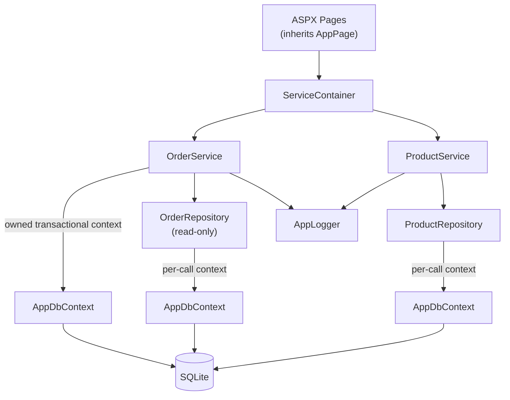
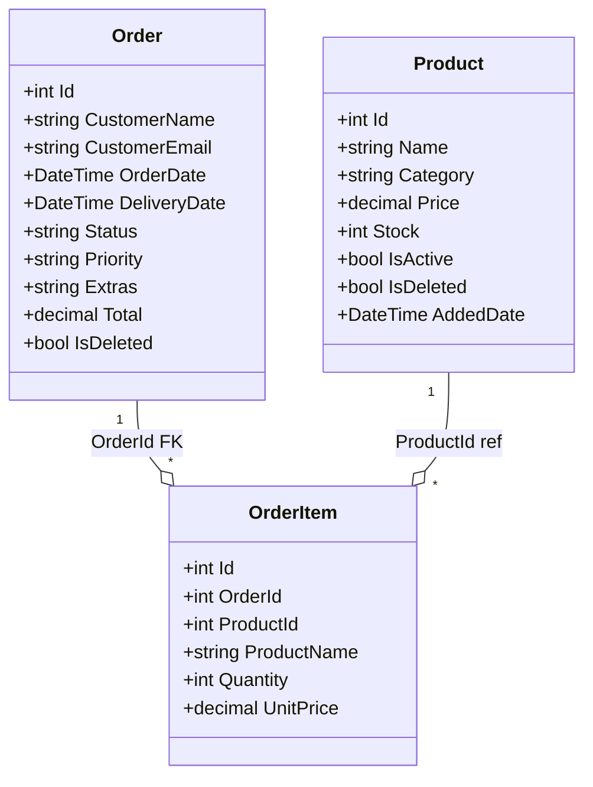

# LegacyWebForms: Inventory Manager

ASP.NET WebForms 4.8 inventory management app backed by EF Core 3.1 and SQLite. No authentication, no tests, local development only.

## Quick Start

```bash
dotnet build LegacyWebForms\LegacyWebForms.csproj
```

Open in Visual Studio (F5) or launch IIS Express manually on port 5080. The SQLite database and seed data (12 products, 12 orders) are auto-created on first request at `App_Data/inventory.db`. Delete this file to re-seed.

## Tech Stack

| Layer | Technology |
|------|-----------|
| Framework | ASP.NET WebForms 4.8, `net48`, C# latest, nullable enabled |
| ORM | EF Core 3.1.32 with SQLite |
| UI | WebForms pages + user controls, custom combo.js autocomplete, site.js confirm dialog |
| Logging | `System.Diagnostics.Trace` + file listener outputting to `App_Data/logs/app.log` |

## Architecture



`AppData` is a static composition root that constructs all dependencies at startup. All pages access services through `AppData.Services.Products.*` and `AppData.Services.Orders.*`. No DI framework is used because WebForms creates pages and controls via reflection, making constructor injection impossible.

Two context lifetime patterns coexist:

- **Per-call (repositories):** Each repo opens a short-lived `AppDbContext` with `using var db = CreateDbContext()`, performs one operation, and disposes it.
- **Owned transactional (OrderService mutations):** `PlaceOrder`, `DeleteOrder` hold a single context open across multiple operations within a transaction, then dispose on completion.

## Project Layout

```
Core/           AppConstants, AppPage (base class), ILogger interface, AppLogger
Services/       ProductService, OrderService (business logic layer)
Data/          IProductRepository, ProductRepository, IOrderRepository, OrderRepository,
               AppDbContext, DbSeeder (interfaces beside their implementations)
Models/        Product, Order, OrderItem, EventModels
Pages/         Default (Dashboard), Products, Orders (each with multiple child controls)
Helpers/       UiHelper (status badge HTML), GridViewHelper (sort arrow rendering)
Scripts/       site.js (global confirm dialog), combo.js (product autocomplete box)
```

## Pages

### Dashboard (`Pages/Default/`)

Uses a single-fetch pattern: `Products.GetAll()` is called once and the result is passed to StatCards, CategoryExpand, and OutOfStock. Two additional DB calls fetch order count and pending order count. Total: 4 DB calls per page load.

### Products (`Pages/Products/`)

GridView with in-memory sorting and filtering (Name, Category, Price, Stock, active/inactive status). Supports inline editing, a read-only detail panel, and an add-product panel. `ProductSummary` always reflects the live catalog regardless of the active/inactive filter.

### Orders (`Pages/Orders/`)

Uses a coordinator pattern: `Orders.aspx.cs` owns three child controls wired together through events.

| Control | Role |
|---------|------|
| **OrderWizard** | 3-step wizard: select products from a custom autocomplete dropdown, review order, then confirm. Cart is stored in Session and persists across page loads. |
| **OrderHistory** | Paginated list using `GetPaged(skip, take)` with a shared `OrdersTable` repeater. Shows all orders including deleted ones (visually dimmed). |
| **OrdersManage** | Full GridView with inline edit, status filter, sort, and soft-delete. Deletion requires a confirm dialog and blocks delivered orders via a two-layer guard (disabled button + server re-check). |

**Event flow:**

- **OrderPlaced** → rebinds all three controls (wizard needs fresh stock, history and manage need the new order).
- **OrderDeleted** → rebinds only history (manage already rebinds itself internally; the wizard is intentionally left stale and self-corrects on the next full page load or order placement).

## Service Layer

### ProductService

Full CRUD operations delegated to `ProductRepository`. `Add` and `Update` validate models with `Validator.TryValidateObject` at the service boundary. `Update` enforces a one-way invariant: if `Stock` reaches zero, `IsActive` is forced to `false` regardless of what the caller sets.

### OrderService

Read methods delegate to `OrderRepository`. Write methods bypass the read-only repository entirely and open their own `AppDbContext` with a transaction.

| Method | Transaction | Cross-entity touch |
|--------|------------|-------------------|
| `PlaceOrder` | Yes | Creates Order + OrderItems, decrements Product stock |
| `UpdateStatus` | No | Sets Status/Priority on an existing Order, validates via DataAnnotation regex |
| `DeleteOrder` | Yes | Restores Product stock from OrderItems, auto-reactivates products where `Stock > 0` |

`OrderRepository` is intentionally read-only because every order mutation also modifies Product entities, requiring cross-entity atomic transactions that a read-only repository cannot provide.

## Data Model



Notable storage details:

- `Product.IsActive` and `Product.IsDeleted` use `HasConversion<int>()` because SQLite has no native boolean type (stored as 0/1).
- `Order.Extras` is `List<string>` persisted as a pipe-delimited string. The pipe character is chosen over comma because commas in extra values (e.g., "Express delivery, priority") would silently corrupt the data on roundtrip.
- `OrderItem` is marked `[Serializable]` to support StateServer or SQLServer session modes if the app is ever migrated.
- No concurrency tokens (`RowVersion`) are configured because SQLite's EF Core provider silently ignores them.

## Key Decisions

| Decision | Rationale |
|----------|-----------|
| Manual DI, no framework | WebForms pages/controls are created by reflection, so constructor injection is not possible. Adding a framework would only add property injection boilerplate. |
| Repositories are pure CRUD | Business logic lives in the service layer, keeping repos simple and focused on data access. |
| OrderRepository is read-only | Order mutations always span Order + Product entities and require transactions, so writes bypass the repo. |
| Extras delimiter is pipe (`\|`) | Commas in extra values would silently split into multiple entries when the string is round-tripped. |
| `\A`/`\z` regex anchors | Standard `^`/`$` anchors match line boundaries, not string boundaries, which could allow multi-line bypass in regex validators. |
| File logging in code, not web.config | `TextWriterTraceListener` resolves relative paths against the IIS Express install directory, not the app root. |
| `ViewStateUserKey = SessionID` | Folds the session ID into the ViewState HMAC, rejecting postbacks from a different session as a CSRF defense. |

## Build and Run

```bash
dotnet build LegacyWebForms\LegacyWebForms.csproj
```

IIS Express may lock the output DLL during builds. If you get a file-lock error, stop IIS Express first:

```powershell
Stop-Process -Name iisexpress
```

## Detailed Documentation

Full implementation documentation with diagrams, code walkthroughs, and API references lives in `../docs/implementation/`:

| Document | Covers |
|----------|--------|
| [00-index.md](../docs/implementation/00-index.md) | Architecture diagrams, layer call flow, component interaction, startup flow, quick reference table |
| [01-core.md](../docs/implementation/01-core.md) | Core layer interfaces, AppConstants, AppPage, ILogger/AppLogger, Global.asax startup, AppData composition root, ServiceContainer, ProductService, OrderService |
| [02-data.md](../docs/implementation/02-data.md) | AppDbContext configuration, context lifetime patterns, ProductRepository CRUD, OrderRepository queries, DbSeeder, all models, SQLite schema DDL |
| [03-pages.md](../docs/implementation/03-pages.md) | Page lifecycle, Site.Master nav, Dashboard single-fetch, Products inline edit + filters, Orders coordinator + wizard + history + manage, shared controls |
| [04-frontend.md](../docs/implementation/04-frontend.md) | combo.js autocomplete state machine, site.js confirm dialog flow, UiHelper status badges, GridViewHelper sort arrows, UpdatePanel regions, badge CSS classes |
| [05-config.md](../docs/implementation/05-config.md) | web.config settings, .csproj build config, ErrorPage.aspx, security model, deployment checklist |

## Migration

This project has been migrated to ASP.NET Core using `CoreWebForms.Sdk`. See the migrated project at `../CoreWebForms/` and the step-by-step migration guide in `../docs/migration/`.
